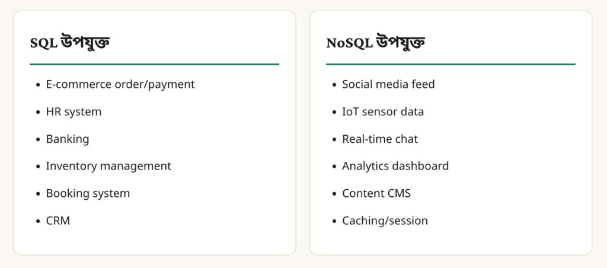

# 🗄️ Comprehensive DBMS & SQL Guide for Software Engineers & Interviews

> **Target Audience:** Software Engineers, Tech Interviewees (WellDev, Brain Station 23, Enosis, etc.), and System Designers.  
> **Source Material:** DBMS Theory & System Design Bangla Notebook.

---

## 1. Classification of SQL Commands

SQL commands are categorized based on their functional purpose within the Database Management System (DBMS).

```
                            ┌────────────────────────────────────────┐
                            │              SQL Commands              │
                            └───────────────────┬────────────────────┘
                                                │
       ┌───────────────┬────────────────┬───────┴────────┬────────────────┐
┌──────▼──────┐ ┌──────▼──────┐  ┌──────▼──────┐  ┌──────▼──────┐  ┌──────▼──────┐
│     DDL     │ │     DML     │  │     DQL     │  │     DCL     │  │     TCL     │
│ (Definition)│ │(Manipulation)│ │   (Query)   │  │  (Control)  │  │(Transaction)│
└─────────────┘ └─────────────┘  └─────────────┘  └─────────────┘  └─────────────┘
```

### A. DDL (Data Definition Language)
* **Purpose:** Modifies the **structure/schema** of database objects (tables, indexes, views, schemas).
* **Auto-Commit:** Yes (DDL statements implicitly commit current transactions in most RDBMS).
* **Key Commands:**
  * `CREATE`: Creates a new table, database, view, or index.
  * `ALTER`: Modifies an existing database structure (add/drop columns, constraints).
  * `DROP`: Deletes an entire database object (structure + data).
  * `TRUNCATE`: Removes all records from a table and resets identity counter.
  * `RENAME`: Renames a database object.

```sql
-- DDL Examples
CREATE TABLE Users (
    user_id INT PRIMARY KEY AUTO_INCREMENT,
    name VARCHAR(100) NOT NULL,
    email VARCHAR(100) UNIQUE
);

ALTER TABLE Users ADD COLUMN created_at TIMESTAMP DEFAULT CURRENT_TIMESTAMP;
```

### B. DML (Data Manipulation Language)
* **Purpose:** Manipulates the **data stored inside** the tables.
* **Auto-Commit:** No (Requires explicit `COMMIT` unless auto-commit is enabled).
* **Key Commands:**
  * `INSERT`: Inserts new records into a table.
  * `UPDATE`: Modifies existing data within a table.
  * `DELETE`: Deletes specific or all records based on conditions.

```sql
-- DML Examples
INSERT INTO Users (name, email) VALUES ('Rahim', 'rahim@example.com');
UPDATE Users SET name = 'Rahim Ahmed' WHERE user_id = 1;
DELETE FROM Users WHERE user_id = 1;
```

### C. DQL (Data Query Language)
* **Purpose:** Used to **fetch/retrieve data** from the database.
* **Key Command:**
  * `SELECT`: Retrieves data from one or more tables.

```sql
-- DQL Example
SELECT user_id, name, email FROM Users WHERE email LIKE '%@example.com';
```

### D. DCL (Data Control Language)
* **Purpose:** Controls **permissions and privileges** on database objects.
* **Key Commands:**
  * `GRANT`: Gives user access privileges to database objects.
  * `REVOKE`: Withdraws user access privileges.

```sql
-- DCL Examples
GRANT SELECT, INSERT ON Users TO 'app_user'@'localhost';
REVOKE INSERT ON Users FROM 'app_user'@'localhost';
```

### E. TCL (Transaction Control Language)
* **Purpose:** Manages **transactions** and maintains data integrity (ACID compliance).
* **Key Commands:**
  * `COMMIT`: Saves changes permanently to the database.
  * `ROLLBACK`: Reverts changes back to the last committed state or savepoint.
  * `SAVEPOINT`: Creates a checkpoint within a transaction for conditional rollback.

```sql
-- TCL Example
BEGIN TRANSACTION;
UPDATE Accounts SET balance = balance - 500 WHERE account_id = 101;
UPDATE Accounts SET balance = balance + 500 WHERE account_id = 102;
SAVEPOINT transfer_done;

-- If an error occurs:
-- ROLLBACK TO transfer_done;
COMMIT;
```

---

## 2. DROP vs TRUNCATE vs DELETE

এটি ইন্টারভিউতে সবচেয়ে বেশি জিজ্ঞাসিত প্রশ্নগুলোর একটি। নিচে এদের মূল পার্থক্যসমূহ তুলে ধরা হলো:

| বৈশিষ্ট্য (Feature) | `DELETE` | `TRUNCATE` | `DROP` |
| :--- | :--- | :--- | :--- |
| **কমান্ডের ধরণ (Type)** | DML (Data Manipulation Language) | DDL (Data Definition Language) | DDL (Data Definition Language) |
| **কাজ (Action)** | টেবিল ঠিক রেখে ভেতরের নির্দিষ্ট বা সব রো (rows) ডিলেট করে। | টেবিল ঠিক রেখে ভেতরের সব রো (rows) একবারে ডিলেট করে। | সম্পূর্ণ টেবিলের স্ট্রাকচার (schema), ইনডেক্স এবং ডেটা চিরতরে মুছে ফেলে। |
| **`WHERE` ক্লজ** | **সাপোর্ট করে** (নির্দিষ্ট রো ডিলেট করা সম্ভব)। | **সাপোর্ট করে না** (সব ডেটা একসাথে ডিলেট হয়)। | **সাপোর্ট করে না** (সম্পূর্ণ টেবিলই ডিলেট হয়ে যায়)। |
| **গতি (Performance)** | **ধীরগতির** (প্রতিটি রো আলাদাভাবে মুছে দেয় এবং ট্রানজেকশন লগ রাখে)। | **অত্যন্ত দ্রুতগতির** (সরাসরি টেবিলের ডেটা পেজগুলো খালি করে দেয়)। | **তাত্ক্ষণিক** (সরাসরি ডেটাবেস মেটাডেটা থেকে টেবিলটি মুছে ফেলে)। |
| **ট্রিগার (Triggers)** | **ট্রিগার ফায়ার হয়** (প্রতিটি রো ডিলেটের সময় `DELETE` ট্রিগার রান করে)। | **ট্রিগার ফায়ার হয় না** (কোনো ট্রিগার রান করে না)। | **ট্রিগার ফায়ার হয় না** (কোনো ট্রিগার রান করে না)। |
| **রোলব্যাক (Rollback)** | **সবসময় সম্ভব** (রোলব্যাক করে ডেটা ফিরিয়ে আনা যায়)। | **সাধারণত সম্ভব নয়** (MySQL/Oracle-এ অটো-কমিট হওয়ায় সম্ভব নয়। তবে Postgres/SQL Server-এ সম্ভব)। | **সাধারণত সম্ভব নয়** (টেবিলটিই মুছে যায়। তবে Postgres-এ ট্রানজেকশনের ভেতর সম্ভব)। |

### উদাহরণসহ বিস্তারিত ব্যাখ্যা (Detailed Explanation with Example)

ধরি আমাদের কাছে **`employees`** নামে একটি টেবিল রয়েছে:

| id | name | salary |
| :--- | :--- | :--- |
| 1 | Rahim | 50000 |
| 2 | Karim | 25000 |
| 3 | Shafi | 45000 |

---

#### ১. `DELETE` উদাহরণ:
```sql
DELETE FROM employees WHERE salary < 30000;
```
* **কী ঘটবে?** 
  - এটি শুধুমাত্র ২ নম্বর আইডিধারী `Karim` (যার বেতন ২৫,০০০) এর রো-টি মুছে দেবে। 
  - বাকিদের ডেটা অক্ষত থাকবে। 
  - আপনি চাইলে ট্রানজেকশনের মাধ্যমে এই ডিলিট হওয়া ডেটাটি `ROLLBACK` করে ফেরত আনতে পারবেন।
  - টেবিল এবং বাকি ডেটা যথারীতি থাকবে।

#### ২. `TRUNCATE` উদাহরণ:
```sql
TRUNCATE TABLE employees;
```
* **কী ঘটবে?**
  - এটি টেবিলের ভেতরের সব রো (১, ২, এবং ৩ নম্বর রো) একবারে সম্পূর্ণ মুছে ফেলবে।
  - টেবিলের স্ট্রাকচার (`id`, `name`, `salary` কলামের হেডারগুলো) খালি অবস্থায় থেকে যাবে (টেবিলটি ডিলিট হবে না)।
  - এটি প্রতিটি রো আলাদা করে মুছে না, বরং সরাসরি ডেটা পেজগুলো খালি করে দেয়। তাই এটি অনেক দ্রুত কাজ করে।
  - সাধারণত এটি `ROLLBACK` করা যায় না (কিছু স্পেশাল ডিবি ব্যতীত) এবং কোনো `DELETE` ট্রিগার ফায়ার হয় না।

#### ৩. `DROP` উদাহরণ:
```sql
DROP TABLE employees;
```
* **কী ঘটবে?**
  - এটি সম্পূর্ণ `employees` টেবিলটিকেই ডেটাবেস থেকে চিরতরে মুছে ফেলবে (ডেটা + টেবিল স্ট্রাকচার দুটোই গায়েব)।
  - এর পর যদি আপনি `SELECT * FROM employees;` কুয়েরি চালান, তবে ডেটাবেস **"Table does not exist"** এরর দেখাবে।
  - এটি কোনোভাবেই `ROLLBACK` করা সম্ভব নয়।

---

## 3. Cascading Operations in SQL

প্যারেন্ট টেবিলের (parent table) কোনো প্রাইমারি কী আপডেট বা ডিলেট করা হলে চাইল্ড টেবিলের (child table) সংশ্লিষ্ট রো-গুলোর ওপর কী প্রভাব পড়বে, তা নির্ধারণ করে ক্যাসকেডিং কনস্ট্রেইন্ট (Cascading constraints)।

### Foreign Key Actions (`ON DELETE` / `ON UPDATE`)

১. **`ON DELETE CASCADE`**: প্যারেন্ট টেবিলের কোনো রো ডিলেট করা হলে চাইল্ড টেবিলের সংশ্লিষ্ট রেফারেন্সড রো-গুলোও স্বয়ংক্রিয়ভাবে ডিলেট হয়ে যাবে।
   * **বাস্তব উদাহরণ (Use Case):** কোনো `User` ডিলেট করা হলে তার করা সমস্ত `Posts` এবং `Comments` স্বয়ংক্রিয়ভাবে ডিলেট হয়ে যাবে।

২. **`ON DELETE SET NULL`**: প্যারেন্ট টেবিলের কোনো রো ডিলেট করা হলে চাইল্ড টেবিলের সংশ্লিষ্ট ফরেন কী কলামের মান স্বয়ংক্রিয়ভাবে `NULL` হয়ে যাবে।
   * **বাস্তব উদাহরণ (Use Case):** কোনো `Department` ডিলেট করা হলে উক্ত ডিপার্টমেন্টের সাথে যুক্ত `Employees` টেবিলে `department_id` কলামটির মান `NULL` হয়ে যাবে।

৩. **`ON DELETE SET DEFAULT`**: প্যারেন্ট টেবিলের কোনো রো ডিলেট করা হলে চাইল্ড টেবিলের সংশ্লিষ্ট ফরেন কী কলামটির মান আগে থেকে সংজ্ঞায়িত ডিফল্ট (default value) মানে সেট হয়ে যাবে।

৪. **`ON DELETE RESTRICT` / `NO ACTION`**: চাইল্ড টেবিলে কোনো রেফারেন্সড রো থাকলে প্যারেন্ট টেবিলের রো-টি ডিলেট হতে বাধা দেবে (এটি রান করলে Foreign Key Constraint Error দেখাবে)।

```sql
CREATE TABLE Orders (
    order_id INT PRIMARY KEY,
    user_id INT,
    order_date DATE,
    FOREIGN KEY (user_id) REFERENCES Users(user_id)
        ON DELETE CASCADE
        ON UPDATE CASCADE
);
```

### ক্যাসকেডিং অপারেশনের বাস্তব উদাহরণ (Practical Example)

ধরি আমাদের ডেটাবেসে দুটি টেবিল রয়েছে:
1. **`departments`** (Parent Table)
2. **`employees`** (Child Table - এখানে `dept_id` হলো Foreign Key)

**প্যারেন্ট টেবিল (`departments`):**
| dept_id | dept_name |
| :--- | :--- |
| 1 | HR |
| 2 | Engineering |

**চাইল্ড টেবিল (`employees`):**
| emp_id | name | dept_id |
| :--- | :--- | :--- |
| 101 | Rahim | 1 |
| 102 | Karim | 2 |
| 103 | Shafi | 2 |

ধরি, আমরা প্যারেন্ট টেবিল থেকে **Engineering (`dept_id = 2`)** ডিপার্টমেন্টটি ডিলিট করতে চাই:
```sql
DELETE FROM departments WHERE dept_id = 2;
```

নিচে ৪টি নিয়মের ক্ষেত্রে চাইল্ড টেবিলটির অবস্থা কেমন হবে তা দেখানো হলো:

---

#### ১. `ON DELETE CASCADE` এর ক্ষেত্রে
প্যারেন্ট থেকে `dept_id = 2` ডিলিট করার সাথে সাথে চাইল্ড টেবিল থেকে Karim ও Shafi-এর রো দুটোও স্বয়ংক্রিয়ভাবে মুছে যাবে।

**আউটপুট চাইল্ড টেবিল (`employees`):**
| emp_id | name | dept_id |
| :--- | :--- | :--- |
| 101 | Rahim | 1 |

---

#### ২. `ON DELETE SET NULL` এর ক্ষেত্রে
প্যারেন্ট থেকে `dept_id = 2` ডিলিট হবে, কিন্তু চাইল্ড টেবিলে করিম ও শাফির `dept_id` কলামের মান `NULL` হয়ে যাবে (তারা কোনো ডিপার্টমেন্ট ছাড়া থাকবে, কিন্তু তাদের ডেটা ডিলিট হবে না)।

**আউটপুট চাইল্ড টেবিল (`employees`):**
| emp_id | name | dept_id |
| :--- | :--- | :--- |
| 101 | Rahim | 1 |
| 102 | Karim | `NULL` |
| 103 | Shafi | `NULL` |

---

#### ৩. `ON DELETE SET DEFAULT` এর ক্ষেত্রে
*(ধরি, `dept_id` কলামের ডিফল্ট মান হচ্ছে `1` বা 'HR')*
প্যারেন্ট থেকে `dept_id = 2` ডিলিট হবে এবং চাইল্ড টেবিলে করিম ও শাফির `dept_id` কলামের মান স্বয়ংক্রিয়ভাবে ডিফল্ট মান `1` এ পরিবর্তন হয়ে যাবে।

**আউটপুট চাইল্ড টেবিল (`employees`):**
| emp_id | name | dept_id |
| :--- | :--- | :--- |
| 101 | Rahim | 1 |
| 102 | Karim | 1 |
| 103 | Shafi | 1 |

---

#### ৪. `ON DELETE RESTRICT` / `NO ACTION` এর ক্ষেত্রে
যেহেতু চাইল্ড টেবিলে `dept_id = 2` এর ডেটা রয়েছে (করিম ও শাফি কাজ করছে), তাই ডেটাবেস প্যারেন্ট টেবিলের Engineering ডিপার্টমেন্টটি ডিলিট হতে **বাধা দিবে** এবং একটি **Foreign Key Constraint Error** দেখাবে। 

প্যারেন্ট এবং চাইল্ড দুটি টেবিলই অপরিবর্তিত থাকবে (কোনো ডেটা ডিলিট হবে না)।

---

## 15. When to Use SQL vs NoSQL

```
                    Decision Matrix
                          │
         Does your data have a strict relational
         structure & require ACID compliance?
                         / \
                       YES  NO
                       /     \
                Use SQL       Is horizontal write scale
             (Postgres, MySQL) or schema flexibility needed?
                                / \
                              YES  NO
                              /     \
                       Use NoSQL   Evaluate Caching / KV
                     (Mongo, Cass)   (Redis, Memcached)
```

### 🏢 Use Cases: কোথায় কোনটি ব্যবহার করবেন?



| SQL উপযুক্ত (Best for SQL) | NoSQL উপযুক্ত (Best for NoSQL) |
| :--- | :--- |
| • E-commerce order/payment | • Social media feed |
| • HR system | • IoT sensor data |
| • Banking | • Real-time chat |
| • Inventory management | • Analytics dashboard |
| • Booking system | • Content CMS |
| • CRM | • Caching/session |

---

