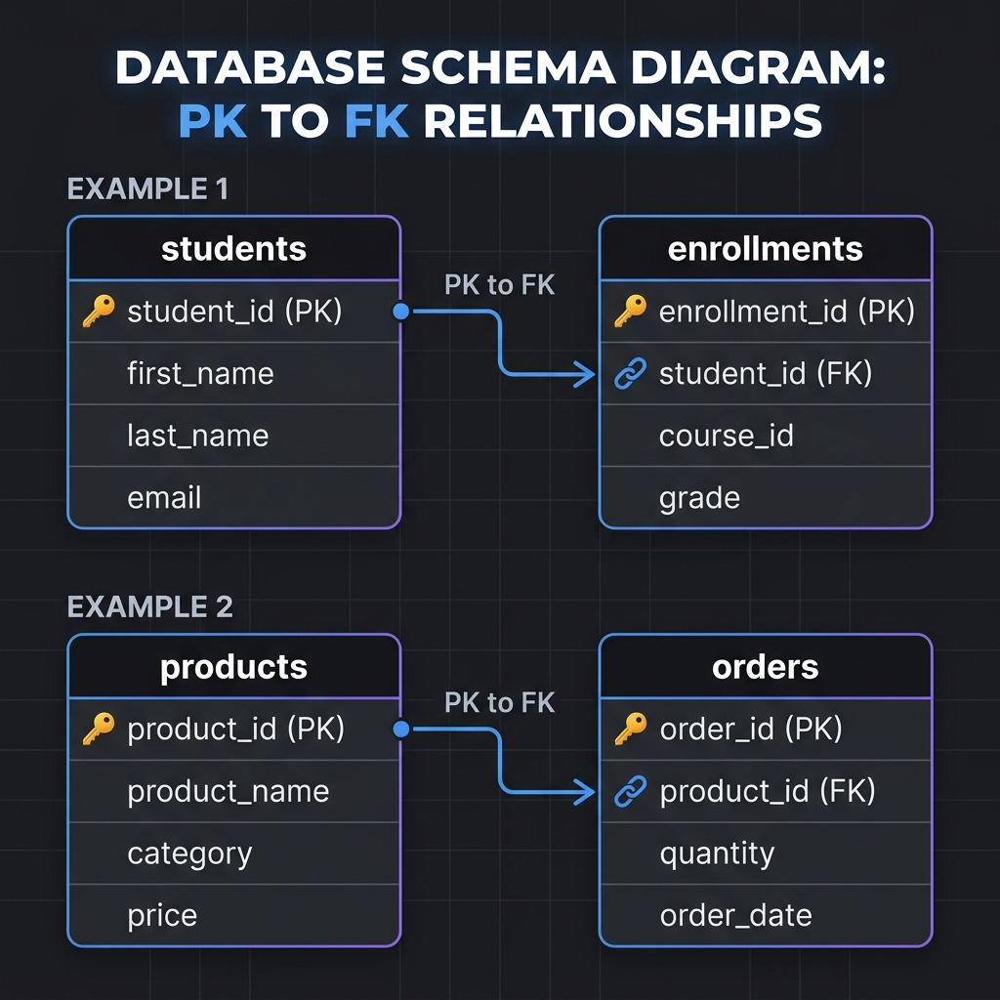

# 🗄️ Comprehensive DBMS & SQL Guide for Software Engineers & Interviews

> **Target Audience:** Software Engineers, Tech Interviewees (WellDev, Brain Station 23, Enosis, etc.), and System Designers.  
> **Source Material:** DBMS Theory & System Design Bangla Notebook.

---

## 📋 Table of Contents
1. [Classification of SQL Commands (DDL, DML, DQL, DCL, TCL)](#1-classification-of-sql-commands)
2. [DROP vs TRUNCATE vs DELETE](#2-drop-vs-truncate-vs-delete)
3. [Cascading Operations in SQL](#3-cascading-operations-in-sql)
4. [Keys & Indexing Deep Dive](#4-keys--indexing-deep-dive)
5. [Normalization & Denormalization](#5-normalization--denormalization)
6. [SQL Query Execution Order](#6-sql-query-execution-order)
7. [SQL Joins & Execution Strategies](#7-sql-joins--execution-strategies)
8. [SQL Top Problem Solving (Nth Highest Salary & More)](#8-sql-top-problem-solving)
9. [Transactions, ACID Properties, Locks, Views & Triggers](#9-transactions-acid-properties-locks-views--triggers)
10. [Stored Procedures vs Functions](#10-stored-procedures-vs-functions)
11. [ER Diagrams & Relationship Modeling](#11-er-diagrams--relationship-modeling)
12. [Distributed DBMS: Sharding, Connection Pool & ORM](#12-distributed-dbms-sharding-connection-pool--orm)
13. [N+1 Query Problem & Solutions](#13-n1-query-problem--solutions)
14. [CAP & PACELC Theorems](#14-cap--pacelc-theorems)
15. [When to Use SQL vs NoSQL](#15-when-to-use-sql-vs-nosql)
16. [SQL Injection (SQLi) & Security](#16-sql-injection-sqli--security)
17. [WellDev Interview Questions & Past Year Insights](#17-welldev-interview-questions--past-year-insights)

---

## 1. Classification of SQL Commands

SQL commands are categorized based on their functional purpose within the Database Management System (DBMS).

```
                            ┌────────────────────────────────────────┐
                            │              SQL Commands              │
                            └───────────────────┬────────────────────┘
                                                │
       ┌───────────────┬────────────────┬───────┴────────┬────────────────┐
┌──────▼──────┐ ┌──────▼──────┐  ┌──────▼──────┐  ┌──────▼──────┐  ┌──────▼──────┐
│     DDL     │ │     DML     │  │     DQL     │  │     DCL     │  │     TCL     │
│ (Definition)│ │(Manipulation)│ │   (Query)   │  │  (Control)  │  │(Transaction)│
└─────────────┘ └─────────────┘  └─────────────┘  └─────────────┘  └─────────────┘
```

### A. DDL (Data Definition Language)
* **Purpose:** Modifies the **structure/schema** of database objects (tables, indexes, views, schemas).
* **Auto-Commit:** Yes (DDL statements implicitly commit current transactions in most RDBMS).
* **Key Commands:**
  * `CREATE`: Creates a new table, database, view, or index.
  * `ALTER`: Modifies an existing database structure (add/drop columns, constraints).
  * `DROP`: Deletes an entire database object (structure + data).
  * `TRUNCATE`: Removes all records from a table and resets identity counter.
  * `RENAME`: Renames a database object.

```sql
-- DDL Examples
CREATE TABLE Users (
    user_id INT PRIMARY KEY AUTO_INCREMENT,
    name VARCHAR(100) NOT NULL,
    email VARCHAR(100) UNIQUE
);

ALTER TABLE Users ADD COLUMN created_at TIMESTAMP DEFAULT CURRENT_TIMESTAMP;
```

### B. DML (Data Manipulation Language)
* **Purpose:** Manipulates the **data stored inside** the tables.
* **Auto-Commit:** No (Requires explicit `COMMIT` unless auto-commit is enabled).
* **Key Commands:**
  * `INSERT`: Inserts new records into a table.
  * `UPDATE`: Modifies existing data within a table.
  * `DELETE`: Deletes specific or all records based on conditions.

```sql
-- DML Examples
INSERT INTO Users (name, email) VALUES ('Rahim', 'rahim@example.com');
UPDATE Users SET name = 'Rahim Ahmed' WHERE user_id = 1;
DELETE FROM Users WHERE user_id = 1;
```

### C. DQL (Data Query Language)
* **Purpose:** Used to **fetch/retrieve data** from the database.
* **Key Command:**
  * `SELECT`: Retrieves data from one or more tables.

```sql
-- DQL Example
SELECT user_id, name, email FROM Users WHERE email LIKE '%@example.com';
```

### D. DCL (Data Control Language)
* **Purpose:** Controls **permissions and privileges** on database objects.
* **Key Commands:**
  * `GRANT`: Gives user access privileges to database objects.
  * `REVOKE`: Withdraws user access privileges.

```sql
-- DCL Examples
GRANT SELECT, INSERT ON Users TO 'app_user'@'localhost';
REVOKE INSERT ON Users FROM 'app_user'@'localhost';
```

### E. TCL (Transaction Control Language)
* **Purpose:** Manages **transactions** and maintains data integrity (ACID compliance).
* **Key Commands:**
  * `COMMIT`: Saves changes permanently to the database.
  * `ROLLBACK`: Reverts changes back to the last committed state or savepoint.
  * `SAVEPOINT`: Creates a checkpoint within a transaction for conditional rollback.

```sql
-- TCL Example
BEGIN TRANSACTION;
UPDATE Accounts SET balance = balance - 500 WHERE account_id = 101;
UPDATE Accounts SET balance = balance + 500 WHERE account_id = 102;
SAVEPOINT transfer_done;

-- If an error occurs:
-- ROLLBACK TO transfer_done;
COMMIT;
```

---

## 2. DROP vs TRUNCATE vs DELETE

এটি ইন্টারভিউতে সবচেয়ে বেশি জিজ্ঞাসিত প্রশ্নগুলোর একটি। নিচে এদের মূল পার্থক্যসমূহ তুলে ধরা হলো:

| বৈশিষ্ট্য (Feature) | `DELETE` | `TRUNCATE` | `DROP` |
| :--- | :--- | :--- | :--- |
| **কমান্ডের ধরণ (Type)** | DML (Data Manipulation Language) | DDL (Data Definition Language) | DDL (Data Definition Language) |
| **কাজ (Action)** | টেবিল ঠিক রেখে ভেতরের নির্দিষ্ট বা সব রো (rows) ডিলেট করে। | টেবিল ঠিক রেখে ভেতরের সব রো (rows) একবারে ডিলেট করে। | সম্পূর্ণ টেবিলের স্ট্রাকচার (schema), ইনডেক্স এবং ডেটা চিরতরে মুছে ফেলে। |
| **`WHERE` ক্লজ** | **সাপোর্ট করে** (নির্দিষ্ট রো ডিলেট করা সম্ভব)। | **সাপোর্ট করে না** (সব ডেটা একসাথে ডিলেট হয়)। | **সাপোর্ট করে না** (সম্পূর্ণ টেবিলই ডিলেট হয়ে যায়)। |
| **গতি (Performance)** | **ধীরগতির** (প্রতিটি রো আলাদাভাবে মুছে দেয় এবং ট্রানজেকশন লগ রাখে)। | **অত্যন্ত দ্রুতগতির** (সরাসরি টেবিলের ডেটা পেজগুলো খালি করে দেয়)। | **তাত্ক্ষণিক** (সরাসরি ডেটাবেস মেটাডেটা থেকে টেবিলটি মুছে ফেলে)। |
| **ট্রিগার (Triggers)** | **ট্রিগার ফায়ার হয়** (প্রতিটি রো ডিলেটের সময় `DELETE` ট্রিগার রান করে)। | **ট্রিগার ফায়ার হয় না** (কোনো ট্রিগার রান করে না)। | **ট্রিগার ফায়ার হয় না** (কোনো ট্রিগার রান করে না)। |
| **রোলব্যাক (Rollback)** | **সবসময় সম্ভব** (রোলব্যাক করে ডেটা ফিরিয়ে আনা যায়)। | **সাধারণত সম্ভব নয়** (MySQL/Oracle-এ অটো-কমিট হওয়ায় সম্ভব নয়। তবে Postgres/SQL Server-এ সম্ভব)। | **সাধারণত সম্ভব নয়** (টেবিলটিই মুছে যায়। তবে Postgres-এ ট্রানজেকশনের ভেতর সম্ভব)। |

### উদাহরণসহ বিস্তারিত ব্যাখ্যা (Detailed Explanation with Example)

ধরি আমাদের কাছে **`employees`** নামে একটি টেবিল রয়েছে:

| id | name | salary |
| :--- | :--- | :--- |
| 1 | Rahim | 50000 |
| 2 | Karim | 25000 |
| 3 | Shafi | 45000 |

---

#### ১. `DELETE` উদাহরণ:
```sql
DELETE FROM employees WHERE salary < 30000;
```
* **কী ঘটবে?** 
  - এটি শুধুমাত্র ২ নম্বর আইডিধারী `Karim` (যার বেতন ২৫,০০০) এর রো-টি মুছে দেবে। 
  - বাকিদের ডেটা অক্ষত থাকবে। 
  - আপনি চাইলে ট্রানজেকশনের মাধ্যমে এই ডিলিট হওয়া ডেটাটি `ROLLBACK` করে ফেরত আনতে পারবেন।
  - টেবিল এবং বাকি ডেটা যথারীতি থাকবে।

#### ২. `TRUNCATE` উদাহরণ:
```sql
TRUNCATE TABLE employees;
```
* **কী ঘটবে?**
  - এটি টেবিলের ভেতরের সব রো (১, ২, এবং ৩ নম্বর রো) একবারে সম্পূর্ণ মুছে ফেলবে।
  - টেবিলের স্ট্রাকচার (`id`, `name`, `salary` কলামের হেডারগুলো) খালি অবস্থায় থেকে যাবে (টেবিলটি ডিলিট হবে না)।
  - এটি প্রতিটি রো আলাদা করে মুছে না, বরং সরাসরি ডেটা পেজগুলো খালি করে দেয়। তাই এটি অনেক দ্রুত কাজ করে।
  - সাধারণত এটি `ROLLBACK` করা যায় না (কিছু স্পেশাল ডিবি ব্যতীত) এবং কোনো `DELETE` ট্রিগার ফায়ার হয় না।

#### ৩. `DROP` উদাহরণ:
```sql
DROP TABLE employees;
```
* **কী ঘটবে?**
  - এটি সম্পূর্ণ `employees` টেবিলটিকেই ডেটাবেস থেকে চিরতরে মুছে ফেলবে (ডেটা + টেবিল স্ট্রাকচার দুটোই গায়েব)।
  - এর পর যদি আপনি `SELECT * FROM employees;` কুয়েরি চালান, তবে ডেটাবেস **"Table does not exist"** এরর দেখাবে।
  - এটি কোনোভাবেই `ROLLBACK` করা সম্ভব নয়।

---

## 3. Cascading Operations in SQL

প্যারেন্ট টেবিলের (parent table) কোনো প্রাইমারি কী আপডেট বা ডিলেট করা হলে চাইল্ড টেবিলের (child table) সংশ্লিষ্ট রো-গুলোর ওপর কী প্রভাব পড়বে, তা নির্ধারণ করে ক্যাসকেডিং কনস্ট্রেইন্ট (Cascading constraints)।

### Foreign Key Actions (`ON DELETE` / `ON UPDATE`)

১. **`ON DELETE CASCADE`**: প্যারেন্ট টেবিলের কোনো রো ডিলেট করা হলে চাইল্ড টেবিলের সংশ্লিষ্ট রেফারেন্সড রো-গুলোও স্বয়ংক্রিয়ভাবে ডিলেট হয়ে যাবে।
   * **বাস্তব উদাহরণ (Use Case):** কোনো `User` ডিলেট করা হলে তার করা সমস্ত `Posts` এবং `Comments` স্বয়ংক্রিয়ভাবে ডিলেট হয়ে যাবে।

২. **`ON DELETE SET NULL`**: প্যারেন্ট টেবিলের কোনো রো ডিলেট করা হলে চাইল্ড টেবিলের সংশ্লিষ্ট ফরেন কী কলামের মান স্বয়ংক্রিয়ভাবে `NULL` হয়ে যাবে।
   * **বাস্তব উদাহরণ (Use Case):** কোনো `Department` ডিলেট করা হলে উক্ত ডিপার্টমেন্টের সাথে যুক্ত `Employees` টেবিলে `department_id` কলামটির মান `NULL` হয়ে যাবে।

৩. **`ON DELETE SET DEFAULT`**: প্যারেন্ট টেবিলের কোনো রো ডিলেট করা হলে চাইল্ড টেবিলের সংশ্লিষ্ট ফরেন কী কলামটির মান আগে থেকে সংজ্ঞায়িত ডিফল্ট (default value) মানে সেট হয়ে যাবে।

৪. **`ON DELETE RESTRICT` / `NO ACTION`**: চাইল্ড টেবিলে কোনো রেফারেন্সড রো থাকলে প্যারেন্ট টেবিলের রো-টি ডিলেট হতে বাধা দেবে (এটি রান করলে Foreign Key Constraint Error দেখাবে)।

```sql
CREATE TABLE Orders (
    order_id INT PRIMARY KEY,
    user_id INT,
    order_date DATE,
    FOREIGN KEY (user_id) REFERENCES Users(user_id)
        ON DELETE CASCADE
        ON UPDATE CASCADE
);
```

### ক্যাসকেডিং অপারেশনের বাস্তব উদাহরণ (Practical Example)

ধরি আমাদের ডেটাবেসে দুটি টেবিল রয়েছে:
1. **`departments`** (Parent Table)
2. **`employees`** (Child Table - এখানে `dept_id` হলো Foreign Key)

**প্যারেন্ট টেবিল (`departments`):**
| dept_id | dept_name |
| :--- | :--- |
| 1 | HR |
| 2 | Engineering |

**চাইল্ড টেবিল (`employees`):**
| emp_id | name | dept_id |
| :--- | :--- | :--- |
| 101 | Rahim | 1 |
| 102 | Karim | 2 |
| 103 | Shafi | 2 |

ধরি, আমরা প্যারেন্ট টেবিল থেকে **Engineering (`dept_id = 2`)** ডিপার্টমেন্টটি ডিলিট করতে চাই:
```sql
DELETE FROM departments WHERE dept_id = 2;
```

নিচে ৪টি নিয়মের ক্ষেত্রে চাইল্ড টেবিলটির অবস্থা কেমন হবে তা দেখানো হলো:

---

#### ১. `ON DELETE CASCADE` এর ক্ষেত্রে
প্যারেন্ট থেকে `dept_id = 2` ডিলিট করার সাথে সাথে চাইল্ড টেবিল থেকে Karim ও Shafi-এর রো দুটোও স্বয়ংক্রিয়ভাবে মুছে যাবে।

**আউটপুট চাইল্ড টেবিল (`employees`):**
| emp_id | name | dept_id |
| :--- | :--- | :--- |
| 101 | Rahim | 1 |

---

#### ২. `ON DELETE SET NULL` এর ক্ষেত্রে
প্যারেন্ট থেকে `dept_id = 2` ডিলিট হবে, কিন্তু চাইল্ড টেবিলে করিম ও শাফির `dept_id` কলামের মান `NULL` হয়ে যাবে (তারা কোনো ডিপার্টমেন্ট ছাড়া থাকবে, কিন্তু তাদের ডেটা ডিলিট হবে না)।

**আউটপুট চাইল্ড টেবিল (`employees`):**
| emp_id | name | dept_id |
| :--- | :--- | :--- |
| 101 | Rahim | 1 |
| 102 | Karim | `NULL` |
| 103 | Shafi | `NULL` |

---

#### ৩. `ON DELETE SET DEFAULT` এর ক্ষেত্রে
*(ধরি, `dept_id` কলামের ডিফল্ট মান হচ্ছে `1` বা 'HR')*
প্যারেন্ট থেকে `dept_id = 2` ডিলিট হবে এবং চাইল্ড টেবিলে করিম ও শাফির `dept_id` কলামের মান স্বয়ংক্রিয়ভাবে ডিফল্ট মান `1` এ পরিবর্তন হয়ে যাবে।

**আউটপুট চাইল্ড টেবিল (`employees`):**
| emp_id | name | dept_id |
| :--- | :--- | :--- |
| 101 | Rahim | 1 |
| 102 | Karim | 1 |
| 103 | Shafi | 1 |

---

#### ৪. `ON DELETE RESTRICT` / `NO ACTION` এর ক্ষেত্রে
যেহেতু চাইল্ড টেবিলে `dept_id = 2` এর ডেটা রয়েছে (করিম ও শাফি কাজ করছে), তাই ডেটাবেস প্যারেন্ট টেবিলের Engineering ডিপার্টমেন্টটি ডিলিট হতে **বাধা দিবে** এবং একটি **Foreign Key Constraint Error** দেখাবে। 

প্যারেন্ট এবং চাইল্ড দুটি টেবিলই অপরিবর্তিত থাকবে (কোনো ডেটা ডিলিট হবে না)।

---

## 4. Keys & Indexing Deep Dive

### A. Database Keys Overview

ডাটাবেস টেবিলের ডেটার মধ্যে সম্পর্ক স্থাপন এবং প্রতিটি রো-কে ইউনিকভাবে চিহ্নিত করার জন্য বিভিন্ন ধরণের **Keys** ব্যবহার করা হয়। নিচে এগুলোকে উদাহরণসহ বিস্তারিত ব্যাখ্যা করা হলো:

#### আমাদের প্রধান উদাহরণ টেবিল: `students`
ধরি আমাদের একটি `students` টেবিল রয়েছে:

| surrogate_id | student_id | nid | email | first_name | last_name |
| :--- | :--- | :--- | :--- | :--- | :--- |
| 1 | S101 | 123456 | rahim@test.com | Rahim | Rahman |
| 2 | S102 | 789012 | karim@test.com | Karim | Ahmed |
| 3 | S103 | 345678 | shafi@test.com | Shafi | Islam |

---

#### ১. Super Key (সুপার কী)
* **সংজ্ঞা**: যেকোনো কলাম বা একাধিক কলামের সমন্বয় যা টেবিলের প্রতিটি রো-কে অন্য রো থেকে ইউনিকলি (আলাদাভাবে) চিহ্নিত করতে পারে।
* **গুরুত্বপূর্ণ বৈশিষ্ট্য**: একটি সুপার কী-তে ইউনিক কলামের পাশাপাশি অতিরিক্ত বা অপ্রয়োজনীয় (redundant/unnecessary) কলামও থাকতে পারে। কলামের সেই পুরো সমন্বয়টি রো আইডেন্টিফাই করতে পারলে তাকে সুপার কী বলা যাবে।

* 🚀 **ক্যান্ডিডেট কী থেকে সুপার কী হিসাব করার গাণিতিক সূত্র (How to Compute Super Keys)**:
  ১. **নিয়ম**: যেকোনো ক্যান্ডিডেট কী (Candidate Key)-এর সাথে অন্য যেকোনো কলাম বা কলামের সেট যোগ করলে একটি সুপার কী তৈরি হয়। গাণিতিকভাবে—যদি $CK$ একটি ক্যান্ডিডেট কী হয় এবং $S$ এমন একটি কলামের সেট হয় যা $CK$-কে নিজের ভেতরে ধারণ করে ($CK \subseteq S$), তবে $S$ একটি সুপার কী।
  ২. **হিসাব করার শর্টকাট সূত্র**:
     - ধরি একটি টেবিল $R(A, B, C, D)$ এবং এর একমাত্র ক্যান্ডিডেট কী হলো **`{A}`**।
     - তাহলে সুপার কী-এর সংখ্যা হবে: $2^{(n-1)}$ (যেখানে $n$ হলো মোট কলামের সংখ্যা)।
     - এখানে মোট কলাম $n = 4$। তাই সুপার কী-এর সংখ্যা হবে: $2^{(4-1)} = 2^3 = 8$ টি।
     - এই ৮টি সুপার কী হলো:
       1. `{A}`
       2. `{A, B}`
       3. `{A, C}`
       4. `{A, D}`
       5. `{A, B, C}`
       6. `{A, B, D}`
       7. `{A, C, D}`
       8. `{A, B, C, D}`

  ৩. **যদি একাধিক ক্যান্ডিডেট কী থাকে (যেমন: `{A}` এবং `{B}`)**:
     - তখন আমাদের সেট থিওরির ফর্মুলা (Inclusion-Exclusion Principle) ব্যবহার করতে হবে:
       $$\text{Total Super Keys} = (\text{Keys containing A}) + (\text{Keys containing B}) - (\text{Keys containing both A and B})$$
     - $A$-কে ধারণকারী সেটের সংখ্যা: $2^{(n-1)} = 2^{4-1} = 8$
     - $B$-কে ধারণকারী সেটের সংখ্যা: $2^{(n-1)} = 2^{4-1} = 8$
     - $A$ এবং $B$ উভয়কেই ধারণকারী সেটের সংখ্যা: $2^{(n-2)} = 2^{4-2} = 4$
     - অতএব, মোট সুপার কী = $8 + 8 - 4 = 12$ টি।

---

#### 📊 ৩টি বাস্তব টেবিল ও উদাহরণের মাধ্যমে সুপার কী নির্ণয় (Super Keys of 3 Real Tables):

বাস্তব টেবিল ও ডাটা দিয়ে চলুন ৩টি ভিন্ন ভিন্ন ক্যান্ডিডেট কী কম্বিনেশনের জন্য সুপার কী বের করা শিখি:

---

##### 📁 টেবিল ১: `students` (একটিমাত্র ক্যান্ডিডেট কী বিশিষ্ট টেবিল)
এখানে ৩টি কলাম রয়েছে:
* `student_id` (ছাত্রের আইডি - ইউনিক)
* `name` (নাম - ডুপ্লিকেট হতে পারে)
* `city` (শহর - ডুপ্লিকেট হতে পারে)

| student_id | name | city |
| :--- | :--- | :--- |
| S101 | Rahim | Dhaka |
| S102 | Karim | Sylhet |
| S103 | Rahim | Chittagong |

* **ক্যান্ডিডেট কী**: এই টেবিলের একমাত্র ক্যান্ডিডেট কী হলো **`{student_id}`** (যেহেতু শুধু এটি দিয়েই প্রতিটি ছাত্রের রো ইউনিকলি চেনা যায়)।
* **সুপার কী (Super Keys) নির্ণয়**:
  - নিয়ম অনুযায়ী, ক্যান্ডিডেট কী `{student_id}` এর সাথে যেকোনো কলাম কম্বিনেশন যুক্ত করলেই সুপার কী পাওয়া যাবে।
  - মোট কলাম $n = 3$, ক্যান্ডিডেট কী এর কলাম $k = 1$।
  - মোট সুপার কী হবে: $2^{(3-1)} = 2^2 = 4$ টি।
  - **এই ৪টি সুপার কী হলো**:
    1. `{student_id}` (শুধু ক্যান্ডিডেট কী নিজেই একটি সুপার কী)
    2. `{student_id, name}` (স্টুডেন্ট আইডি ও নাম মিলে সুপার কী)
    3. `{student_id, city}` (স্টুডেন্ট আইডি ও শহর মিলে সুপার কী)
    4. `{student_id, name, city}` (সবগুলো কলাম একসাথে নিয়ে সুপার কী)

---

##### 📁 টেবিল ২: `products` (২টি আলাদা ১-কলামের ক্যান্ডিডেট কী বিশিষ্ট টেবিল)
এখানে ৩টি কলাম রয়েছে:
* `product_id` (পণ্যের আইডি - ইউনিক)
* `barcode` (বারকোড - ইউনিক)
* `price` (মূল্য - ডুপ্লিকেট হতে পারে)

| product_id | barcode | price |
| :--- | :--- | :--- |
| P01 | BAR881 | 120 |
| P02 | BAR882 | 450 |
| P03 | BAR883 | 120 |

* **ক্যান্ডিডেট কী**: এই টেবিলে ২টি ক্যান্ডিডেট কী রয়েছে— **`{product_id}`** এবং **`{barcode}`**।
* **সুপার কী (Super Keys) নির্ণয়**:
  - নিয়ম অনুযায়ী, যে সেটে `{product_id}` অথবা `{barcode}` যেকোনো একটি (বা উভয়টি) থাকবে, সেটিই সুপার কী।
  - মোট কলাম $n = 3$।
  - Inclusion-Exclusion সূত্র অনুযায়ী:
    $$\text{Total} = (\text{Keys containing product id}) + (\text{Keys containing barcode}) - (\text{Keys containing both})$$
    $$\text{Total} = 2^{(3-1)} + 2^{(3-1)} - 2^{(3-2)} = 2^2 + 2^2 - 2^1 = 4 + 4 - 2 = 6 \text{ টি।}$$
  - **এই ৬টি সুপার কী হলো**:
    1. `{product_id}`
    2. `{barcode}`
    3. `{product_id, price}`
    4. `{barcode, price}`
    5. `{product_id, barcode}`
    6. `{product_id, barcode, price}`

---

##### 📁 টেবিল ৩: `enrollments` (১টি ২-কলামের কম্পোজিট ক্যান্ডিডেট কী বিশিষ্ট টেবিল)
এখানে ৩টি কলাম রয়েছে:
* `student_id` (ছাত্রের আইডি - একা ইউনিক নয়)
* `course_id` (কোর্স আইডি - একা ইউনিক নয়)
* `grade` (গ্রেড - ডুপ্লিকেট হতে পারে)

| student_id | course_id | grade |
| :--- | :--- | :--- |
| S101 | CSE101 | A |
| S101 | CSE102 | B |
| S102 | CSE101 | A |

* **ক্যান্ডিডেট কী**: এই টেবিলে কোনো একক কলাম ইউনিক নয়। তাই ক্যান্ডিডেট কী হলো কম্পোজিট কী: **`{student_id, course_id}`**।
* **সুপার কী (Super Keys) নির্ণয়**:
  - নিয়ম অনুযায়ী, সুপার কী-তে অবশ্যই `{student_id, course_id}` কলাম দুটি একসাথে থাকতে হবে।
  - মোট কলাম $n = 3$, ক্যান্ডিডেট কী এর কলাম $k = 2$।
  - মোট সুপার কী হবে: $2^{(3-2)} = 2^1 = 2$ টি।
  - **এই ২টি সুপার কী হলো**:
    1. `{student_id, course_id}`
    2. `{student_id, course_id, grade}`

---

#### ২. Candidate Key (ক্যান্ডিডেট কী)
* **সংজ্ঞা**: সুপার কী-গুলোর মধ্যে যে কলাম বা কলামের সেটগুলো **মিনিমাল (minimal)** কলাম নিয়ে গঠিত (অর্থাৎ অতিরিক্ত অপ্রয়োজনীয় কোনো কলাম থাকে না), সেগুলোকে ক্যান্ডিডেট কী বলে।
* **আমাদের উদাহরণ**:
  - `(student_id, first_name)` এটি সুপার কী হলেও ক্যান্ডিডেট কী নয়, কারণ `first_name` বাদ দিলেও `student_id` একা একটি রো চিহ্নিত করতে পারে।
  - এই টেবিলে ক্যান্ডিডেট কী হবে ৩টি: **`student_id`**, **`nid`**, এবং **`email`**। কারণ এদের প্রতিটি কলাম একা একটি রো চিহ্নিত করতে যথেষ্ট এবং এদের সাথে কোনো অতিরিক্ত কলাম নেই।

* 💡 **কনসেপ্ট ক্লিয়ারিং ও ইন্টারভিউ লজিক (Candidate Key & Minimality Deep Dive)**:
  - **প্রশ্ন: ক্যান্ডিডেট কী ১টি কলামের হলে, একই টেবিলে ২টি কলামের আরেকটি ক্যান্ডিডেট কী কীভাবে থাকতে পারে? "Minimal" মানে তো সর্বনিম্ন বা ১টি কলাম হওয়ার কথা, তাহলে ২ কলামের কী কীভাবে Minimal হয়?**
    - **উত্তর**: এটি ডাটাবেস থিওরির এবং গাণিতিক সেট থিওরির (Set Theory) একটি অন্যতম বিভ্রান্তিকর বিষয়। 
    - ডাটাবেস থিওরিতে ক্যান্ডিডেট কী-কে **Minimum Superkey** বলা হয় না, বলা হয় **Minimal Superkey**। এই দুটির মধ্যে বড় গাণিতিক পার্থক্য রয়েছে:
      * **Minimum (সার্বজনীনভাবে সর্বনিম্ন)**: এর মানে হলো পুরো টেবিলের সব সুপার কী-এর মধ্যে কলাম সংখ্যার দিক থেকে যেটি সবচেয়ে ছোট (Global Cardinality)। যদি এই নিয়ম চলত, তবে ১ কলামের কী থাকলে ২ কলামের ক্যান্ডিডেট কী কখনো হতে পারত না।
      * **Minimal (স্থানীয়ভাবে অবিভাজ্য বা Irreducible)**: এর অর্থ হলো এমন একটি সুপার কী, যার ভেতর থেকে **একটি কলামও বাদ দিলে তা আর সুপার কী থাকে না**।
    - **পার্থক্য বোঝার উদাহরণ (বাংলাদেশী প্রেক্ষাপট)**:
      ধরি, আমাদের বাংলাদেশ শিক্ষা বোর্ডের এইচএসসি পরীক্ষার্থীদের একটি টেবিল আছে:
      `hsc_candidates(candidate_id, registration_no, board_name, roll_no, passing_year, student_name)`
      
      ১. **`{candidate_id}`** (সিস্টেমের অটো-জেনারেটেড ইউনিক আইডি) $\rightarrow$ এটি ১টি কলামের চাবি। এর থেকে আর কোনো কলাম বাদ দেওয়া যায় না, তাই এটি ক্যান্ডিডেট কী।
      ২. **`{registration_no}`** (বোর্ডের রেজিস্ট্রেশন নম্বর) $\rightarrow$ এটিও ১টি কলামের চাবি এবং এটিও ইউনিক। এটিও একটি ক্যান্ডিডেট কী।
      ৩. এবার **`{board_name, roll_no, passing_year}`** (৩টি কলামের কম্বিনেশন) সেটটি লক্ষ্য করুন। এটিও কিন্তু ইউনিক (সুপার কী)। কারণ বাংলাদেশে কোনো নির্দিষ্ট বোর্ডে, একই বছরে, একই রোল নম্বর দুজন ছাত্রের হতে পারে না।
      ৪. এবার মিনিমালিটি পরীক্ষা করার জন্য এই সেট থেকে উপাদানগুলো একে একে বাদ দিয়ে দেখি:
        - `passing_year` বাদ দিলে থাকে `{board_name, roll_no}` $\rightarrow$ এটি কি ইউনিক? **না** (কারণ একই বোর্ডে একই রোল নম্বর প্রতি বছরই নতুন ছাত্রদের দেওয়া হয়)।
        - `board_name` বাদ দিলে থাকে `{roll_no, passing_year}` $\rightarrow$ এটি কি ইউনিক? **না** (কারণ একই বছরে বিভিন্ন বোর্ডে একই রোল নম্বরের ছাত্র পরীক্ষা দেয়, যেমন ঢাকা ও রাজশাহী উভয় বোর্ডে রোল `১০৪৫২৩` থাকতে পারে)।
        - `roll_no` বাদ দিলে থাকে `{board_name, passing_year}` $\rightarrow$ এটি কি ইউনিক? **না** (একটি বোর্ডে একই বছরে হাজার হাজার ছাত্র পরীক্ষা দেয়)।
      ৫. যেহেতু `{board_name, roll_no, passing_year}` সেটের ভেতর থেকে কোনো একটি কলামও বাদ দিলে তা আর ইউনিক থাকে না, তাই এই ৩ কলামের জোড়াটি **স্থানীয়ভাবে অবিভাজ্য বা Minimal**। 
      ৬. টেবিলে ১ কলামের `{candidate_id}` বা `{registration_no}` থাকা সত্ত্বেও, `{board_name, roll_no, passing_year}` জোড়াটি নিজে থেকে অবিভাজ্য হওয়ায় এটিও একটি ১০০% বৈধ ক্যান্ডিডেট কী।
    - **অফিসিয়াল টেক্সটবুক রুল (Minimality Rule)**:
      > *"A superkey K is minimal (and therefore a candidate key) if no proper subset of K is also a superkey."* 
      যেহেতু ১ কলামের `{candidate_id}` বা `{registration_no}` সেটটি ৩ কলামের `{board_name, roll_no, passing_year}` সেটের সাবসেট (subset) নয়, তাই এদের অস্তিত্ব ৩ কলামের ক্যান্ডিডেট কী হওয়াতে কোনো বাধা সৃষ্টি করে না।

### 🔑 ক্যান্ডিডেট কী (Candidate Key) বের করার সহজ শর্টকাট সূত্র (Closure Method)

ডাটাবেস পরীক্ষায় বা ইন্টারভিউতে ক্যান্ডিডেট কী বের করার জন্য **Attribute Closure ($X^+$) পদ্ধতি** ব্যবহার করা হয়। নিচে ৩টি সহজ নিয়মে ক্যান্ডিডেট কী বের করার শর্টকাট সূত্র দেওয়া হলো:

#### **ধাপ ১: বাম-ডান সূত্র (Left-Right Rule)**
সবগুলো Functional Dependency ($X \rightarrow Y$) ভালো করে লক্ষ্য করুন এবং কলামগুলোকে ৩টি ক্যাটাগরিতে ভাগ করুন:

> ⚠️ **ভুল ধারণা এড়ান (LHS & RHS Misconception Alert)**: 
> এখানে "বাম পাশ" এবং "ডান পাশ" বলতে কিন্তু ডাটাবেস টেবিলে কলামগুলো শারীরিকভাবে (physically) বামে না ডানে সাজানো আছে তা বোঝানো হচ্ছে না। টেবিলে কলামের ক্রমানুসারের কোনো প্রভাব ডাটাবেস লজিকে নেই। এখানে "বাম" ও "ডান" বলতে শুধুমাত্র তীর চিহ্নের বাম দিক ($X$) এবং ডান দিক ($Y$) বোঝানো হচ্ছে।

1. **Left Only (শুধুমাত্র বামে)**: যে কলামগুলো শুধুমাত্র তীর চিহ্নের বাম পাশে (Left hand side) আছে, কিন্তু কোনোটির ডান পাশে নেই। 
   * *সূত্র*: এরা **১০০% ক্যান্ডিডেট কী-এর অংশ হবেই**।
2. **Right Only (শুধুমাত্র ডানে)**: যে কলামগুলো শুধুমাত্র চিহ্নের ডান পাশে (Right hand side) আছে, কিন্তু কোনোটির বাম পাশে নেই।
   * *সূত্র*: এরা **কখনোই ক্যান্ডিডেট কী-এর অংশ হতে পারবে না**। এদের চোখ বন্ধ করে বাদ দিয়ে দিন।
3. **Both (উভয় পাশে)**: যে কলামগুলো বাম এবং ডান উভয় পাশেই উপস্থিত আছে।
   * *সূত্র*: এরা ক্যান্ডিডেট কী-এর অংশ হতেও পারে, আবার নাও হতে পারে।

---

#### **ধাপ ২: ক্লোজার ($X^+$) পরীক্ষা করা**
* ধাপ ১ থেকে আমরা যে **"Left Only"** কলামগুলো পেয়েছি, প্রথমে সেগুলোর ক্লোজার ($X^+$) বের করুন।
* *ক্লোজার বের করার নিয়ম*: কোনো কলামের ক্লোজার মানে হলো ওই কলামটি দিয়ে ডিরেক্ট বা ইনডিরেক্টলি টেবিলের কোন কোন কলামের মান বের করা সম্ভব।
* **যদি ক্লোজারে টেবিলের সব কলাম চলে আসে**, তবে ওই সেটটিই হলো আমাদের **একমাত্র ক্যান্ডিডেট কী**। কাজ শেষ!

---

#### **ধাপ ৩: কলাম কম্বিনেশন তৈরি (প্রয়োজন হলে)**
* যদি ধাপ ২-এর ক্লোজারে সব কলাম না আসে, তবে "Both" ক্যাটাগরির কলামগুলো থেকে একটি একটি করে কলাম "Left Only" কলামের সাথে যুক্ত করে ক্লোজার চেক করুন, যতক্ষণ না সব কলাম কাভার হয়।

---

#### **বাস্তব উদাহরণ দিয়ে বুঝুন (Example):**
ধরি একটি টেবিল $R(A, B, C, D)$ এবং এর নির্ভরতাগুলো হলো:
1. $A \rightarrow B$
2. $B \rightarrow C$
3. $C \rightarrow D$

* **ধাপ ১ (ডান-বাম ভাগ করা)**:
  - বাম পাশের কলাম: $A, B, C$
  - ডান পাশের কলাম: $B, C, D$
  - **Left Only (শুধুমাত্র বামে)**: **$A$** (কারণ $A$ কোনোটির ডান পাশে নেই। তাই ক্যান্ডিডেট কী-তে $A$ থাকবেই!)
  - **Right Only (শুধুমাত্র ডানে)**: **$D$** (কারণ $D$ কোনোটির বাম পাশে নেই। তাই এটি ক্যান্ডিডেট কী-তে থাকবেই না!)
  - **Both (উভয় পাশে)**: $B, C$

* **ধাপ ২ (A-এর ক্লোজার বের করি)**:
  - $A^+ = \{A\}$ (প্রতিটি কলাম নিজের মান বের করতে পারে)
  - $A \rightarrow B$ এর সাহায্যে $B$ যোগ করি: $\{A, B\}$
  - $B \rightarrow C$ এর সাহায্যে $C$ যোগ করি: $\{A, B, C\}$
  - $C \rightarrow D$ এর সাহায্যে $D$ যোগ করি: $\{A, B, C, D\}$
  - যেহেতু $A^+$ এর ভেতর টেবিলের সব কলাম $\{A, B, C, D\}$ চলে এসেছে, তাই **`{A}`** হলো এই টেবিলের **একমাত্র Candidate Key**।

---

#### 📊 ক্যান্ডিডেট কী বের করার বাস্তব টেবিল ও ধাপভিত্তিক উদাহরণ (Step-by-Step with Real Table)

চলুন একটি বাস্তব টেবিল এবং ডাটা দিয়ে বিষয়টি একদম বাচ্চাদের মতো সহজে বুঝে নিই।

ধরি, আমাদের একটি লাইব্রেরি বুক বরোয়িং (বই ধার নেওয়া) টেবিল রয়েছে যার নাম: `book_borrows`
এখানে কলামগুলো হলো:
* `student_id` (ছাত্রের আইডি)
* `book_id` (বইয়ের আইডি)
* `borrow_date` (বই ধার নেওয়ার তারিখ)
* `student_name` (ছাত্রের নাম)
* `book_title` (বইয়ের নাম)

**আমাদের বাস্তব টেবিলটি দেখতে এইরকম (৭টি ডাটা রো সহ):**
| student_id | book_id | borrow_date | student_name | book_title |
| :--- | :--- | :--- | :--- | :--- |
| S101 | B01 | 2026-07-01 | Rahim | Physics |
| S101 | B02 | 2026-07-02 | Rahim | Chemistry |
| S102 | B01 | 2026-07-01 | Karim | Physics |
| S103 | B03 | 2026-07-05 | Shafi | Math |
| S104 | B01 | 2026-07-03 | David | Physics |
| S105 | B04 | 2026-07-04 | Eve | English |
| S106 | B02 | 2026-07-06 | Frank | Chemistry |

##### টেবিলের নিয়ম বা Functional Dependencies (FDs):
১. `student_id` $\rightarrow$ `student_name` (অর্থাৎ, ছাত্রের আইডি জানা থাকলে তার নাম নিশ্চিতভাবে বের করা যাবে।)
২. `book_id` $\rightarrow$ `book_title` (অর্থাৎ, বইয়ের আইডি জানা থাকলে বইয়ের নাম নিশ্চিতভাবে বের করা যাবে।)
৩. `(student_id, book_id)` $\rightarrow$ `borrow_date` (অর্থাৎ, কোনো একটি বই কোন ছাত্র কবে নিয়েছে তা জানতে ছাত্রের আইডি এবং বইয়ের আইডি দুটোই একসাথে লাগবে।)

---

##### 🚀 ক্যান্ডিডেট কী বের করার ধাপসমূহ (Step-by-Step Resolution):

#### **ধাপ ১: বাম-ডান সূত্র প্রয়োগ (Left-Right Rule)**
আমরা FDs গুলোর তীর চিহ্নের বাম ও ডান পাশের কলামগুলো আলাদা করি:
* **বাম পাশের কলামগুলোর সেট**: `{student_id, book_id}`
* **ডান পাশের কলামগুলোর সেট**: `{student_name, book_title, borrow_date}`

এবার ক্যাটাগরি তৈরি করি:
1. **Left Only (শুধুমাত্র বামে)**: **`student_id`** এবং **`book_id`** (কারণ এরা কেবল বাম পাশেই আছে, কোনোটির ডান পাশে নেই)।
   - *নিয়ম*: ক্যান্ডিডেট কী-তে `student_id` এবং `book_id` **১০০% থাকবেই**।
2. **Right Only (শুধুমাত্র ডানে)**: **`student_name`**, **`book_title`**, এবং **`borrow_date`** (কারণ এরা কেবল ডান পাশেই আছে, বাম পাশে নেই)।
   - *নিয়ম*: এরা **কখনোই ক্যান্ডিডেট কী-এর অংশ হতে পারবে না**। এদের চিরতরে বাদ দিয়ে দিন।
3. **Both (উভয় পাশে)**: এমন কোনো কলাম নেই।

---

#### **ধাপ ২: ক্লোজার পরীক্ষা করা (Attribute Closure)**
আমাদের অবশ্যই থাকা কলামের সেটটি হলো: **`{student_id, book_id}`**। এবার এর ক্লোজার বের করব।

* **সাব-ধাপ ২.১ (শুরু)**: প্রথমে চাবির কলামগুলো নিজেরা নিজেদের ক্লোজারে বসে যাবে:
  $$\{student\_id, book\_id\}^+ = \{student\_id, book\_id\}$$
  *(আমরা এখন পর্যন্ত `student_id` এবং `book_id` খুঁজে পেয়েছি)*
  
* **সাব-ধাপ ২.২ (স্টুডেন্টের নাম খোঁজা)**: আমাদের প্রথম নিয়ম `student_id` $\rightarrow$ `student_name` ব্যবহার করি। যেহেতু আমাদের হাতে `student_id` আছে, তাই আমরা `student_name`-কে ক্লোজার সেটে যোগ করে দিতে পারি:
  $$\{student\_id, book\_id\}^+ = \{student\_id, book\_id, student\_name\}$$
  *(আমরা এবার `student_name` পেয়ে গেলাম)*

* **সাব-ধাপ ২.৩ (বইয়ের নাম খোঁজা)**: আমাদের দ্বিতীয় নিয়ম `book_id` $\rightarrow$ `book_title` ব্যবহার করি। যেহেতু আমাদের হাতে `book_id` আছে, তাই আমরা `book_title`-কে ক্লোজার সেটে যোগ করে দিতে পারি:
  $$\{student\_id, book\_id\}^+ = \{student\_id, book\_id, student\_name, book\_title\}$$
  *(আমরা এবার `book_title` পেয়ে গেলাম)*

* **সাব-ধাপ ২.৪ (তারিখ খোঁজা)**: আমাদের তৃতীয় নিয়ম `(student_id, book_id)` $\rightarrow$ `borrow_date` ব্যবহার করি। যেহেতু আমাদের সেটে `student_id` এবং `book_id` দুটোই উপস্থিত আছে, তাই আমরা `borrow_date`-কে ক্লোজার সেটে যোগ করে দিতে পারি:
  $$\{student\_id, book\_id\}^+ = \{student\_id, book\_id, student\_name, book\_title, borrow\_date\}$$
  *(আমরা এবার `borrow_date` পেয়ে গেলাম)*

---

#### **চূড়ান্ত ফলাফল (Final Verification):**
আমরা দেখতে পাচ্ছি যে `{student_id, book_id}^+` ক্লোজারটি টেবিলের **সবগুলো কলাম** কাভার করে ফেলেছে। 

অতএব, **`{student_id, book_id}`** হলো এই টেবিলের **একমাত্র ক্যান্ডিডেট কী (Composite Candidate Key)**!

---

### 📚 ক্যান্ডিডেট কী বের করার আরও ৩টি অ্যাডভান্সড ও বাস্তব উদাহরণ (Advanced Examples)

বিভিন্ন জটিলতা ও কলাম কম্বিনেশনের ওপর ভিত্তি করে নিচে ৩টি বাস্তব উদাহরণ ধাপ ও সাব-ধাপসহ বিস্তারিত আলোচনা করা হলো:

---

#### 🌟 উদাহরণ ১: ১-কলামের এবং ২-কলামের ক্যান্ডিডেট কী একসাথে থাকার উদাহরণ
*(একই টেবিলে একটি ১-কলামের ক্যান্ডিডেট কী এবং একটি ২-কলামের ক্যান্ডিডেট কী একসাথে থাকবে)*

ধরি, আমাদের একটি গাড়ির ফিটনেস ও রুট পারমিট টেবিল রয়েছে: `vehicle_permits`
এখানে কলামগুলো হলো:
* `permit_id` (পারমিটের অটো-জেনারেটেড ইউনিক আইডি)
* `state_code` (স্টেটের নাম, যেমন: DHAKA, CHITTAGONG)
* `license_plate_no` (লাইসেন্স প্লেট নম্বর)
* `owner_name` (মালিকের নাম)

**আমাদের বাস্তব টেবিলটি (৭টি ডাটা রো সহ):**
| permit_id | state_code | license_plate_no | owner_name |
| :--- | :--- | :--- | :--- |
| P901 | DHAKA | Metro-G-1122 | Rahim |
| P902 | DHAKA | Metro-H-3344 | Karim |
| P903 | CHITTAGONG | Metro-G-1122 | Shafi |
| P904 | SYLHET | Metro-K-5566 | David |
| P905 | CHITTAGONG | Metro-H-3344 | Eve |
| P906 | DHAKA | Metro-K-5566 | Frank |
| P907 | RAJSHAHI | Metro-M-7788 | Grace |

##### টেবিলের নিয়ম বা FDs:
১. `permit_id` $\rightarrow$ `{state_code, license_plate_no, owner_name}` (পারমিট আইডি জানা থাকলে বাকি সব তথ্য পাওয়া যাবে)
২. `{state_code, license_plate_no}` $\rightarrow$ `{permit_id, owner_name}` (স্টেট কোড ও প্লেট নম্বর জানা থাকলে গাড়ির মালিক ও পারমিট আইডি জানা যাবে)

##### 🚀 ক্যান্ডিডেট কী বের করার ধাপসমূহ:

* **ধাপ ১: বাম-ডান সূত্র প্রয়োগ (Left-Right Rule)**
  - বাম পাশের কলামের সেট: `{permit_id, state_code, license_plate_no}`
  - ডান পাশের কলামের সেট: `{permit_id, state_code, license_plate_no, owner_name}`
  - **Left Only (শুধুমাত্র বামে)**: কোনো কলাম নেই।
  - **Right Only (শুধুমাত্র ডানে)**: **`owner_name`** (কারণ এটি কেবল ডানে আছে, কোনো নিয়মের বামে নেই। এটি চাবিতে থাকবে না!)
  - **Both (উভয় পাশে)**: `permit_id`, `state_code`, `license_plate_no` (এরা ডানে ও বামে উভয় পাশেই আছে)

* **ধাপ ২: ক্যান্ডিডেট কী সনাক্তকরণ (ক্লোজার টেস্ট)**
  যেহেতু "Left Only" কোনো কলাম নেই, তাই আমরা "Both" সেটের কলামগুলো নিয়ে পরীক্ষা শুরু করব:
  
  * **টেস্ট ১ (permit_id-এর ক্লোজার)**:
    - সাব-ধাপ ১.১: `{permit_id}^+ = {permit_id}`
    - সাব-ধাপ ১.২: নিয়ম ১ (`permit_id` $\rightarrow$ সব) ব্যবহার করে পাই: `{permit_id}^+ = {permit_id, state_code, license_plate_no, owner_name}`
    - যেহেতু সব কলাম চলে এসেছে, তাই **`{permit_id}`** একটি **১-কলামের ক্যান্ডিডেট কী**।
    
  * **টেস্ট ২ ({state_code, license_plate_no} এর ক্লোজার)**:
    - সাব-ধাপ ২.১: `{state_code, license_plate_no}^+ = {state_code, license_plate_no}`
    - সাব-ধাপ ২.২: নিয়ম ২ (`{state_code, license_plate_no}` $\rightarrow$ সব) ব্যবহার করে পাই: `{state_code, license_plate_no}^+ = {state_code, license_plate_no, permit_id, owner_name}`
    - যেহেতু সব কলাম চলে এসেছে এবং এর কোনো সাবসেট (যেমন: শুধু `state_code` বা শুধু `license_plate_no`) ইউনিক নয়, তাই **`{state_code, license_plate_no}`** একটি **২-কলামের ক্যান্ডিডেট কী**।

* **চূড়ান্ত ক্যান্ডিডেট কীসমূহ**: `{permit_id}` (১ কলাম) এবং `{state_code, license_plate_no}` (২ কলাম)।

---

#### 🌟 উদাহরণ ২: একাধিক ২-কলামের ক্যান্ডিডেট কী থাকার উদাহরণ
*(একই টেবিলে একাধিক ২-কলামের ক্যান্ডিডেট কী থাকবে, যেমন: (student_id, seminar_id) এবং (student_id, mentor_id))*

ধরি, আমাদের একটি ইউনিভার্সিটির সেমিনার হল বুকিং টেবিল রয়েছে: `seminar_bookings`
এখানে কলামগুলো হলো:
* `student_id` (ছাত্রের আইডি)
* `seminar_id` (সেমিনারের আইডি)
* `mentor_id` (শিক্ষক বা মেন্টরের আইডি)
* `room_no` (রুম নম্বর)

**আমাদের বাস্তব টেবিলটি (৭টি ডাটা রো সহ):**
| student_id | seminar_id | mentor_id | room_no |
| :--- | :--- | :--- | :--- |
| S101 | SEM50 | M801 | Room A |
| S101 | SEM60 | M802 | Room B |
| S102 | SEM50 | M801 | Room A |
| S103 | SEM50 | M801 | Room A |
| S103 | SEM70 | M803 | Room C |
| S104 | SEM80 | M804 | Room D |
| S105 | SEM50 | M801 | Room A |

##### টেবিলের নিয়ম বা FDs:
১. `{student_id, seminar_id}` $\rightarrow$ `{mentor_id, room_no}` (একজন ছাত্র একটি নির্দিষ্ট সেমিনারের জন্য কোন রুমে যাবে এবং কে মেন্টর তা ইউনিক।)
২. `{student_id, mentor_id}` $\rightarrow$ `{seminar_id, room_no}` (একজন ছাত্রের একজন মেন্টরের সাথে কেবল একটি সেমিনারই থাকতে পারে।)
৩. `mentor_id` $\rightarrow$ `seminar_id` (প্রতিটি মেন্টর কেবল ১টি নির্দিষ্ট সেমিনারই পরিচালনা করেন।)

##### 🚀 ক্যান্ডিডেট কী বের করার ধাপসমূহ:

* **ধাপ ১: বাম-ডান সূত্র প্রয়োগ**
  - বাম পাশের কলাম: `student_id`, `seminar_id`, `mentor_id`
  - ডান পাশের কলাম: `mentor_id`, `room_no`, `seminar_id`
  - **Left Only (শুধুমাত্র বামে)**: **`student_id`** (কারণ এটি কোনো নিয়মের ডান পাশে নেই। তাই ক্যান্ডিডেট কী-তে `student_id` থাকতেই হবে!)
  - **Right Only (শুধুমাত্র ডানে)**: **`room_no`** (এটি চাবিতে থাকবে না)
  - **Both (উভয় পাশে)**: `seminar_id`, `mentor_id`

* **ধাপ ২: ক্যান্ডিডেট কী সনাক্তকরণ (ক্লোজার টেস্ট)**
  যেহেতু `student_id` অবশ্যই থাকবে, তাই আমরা এর সাথে "Both" কলামগুলো যোগ করে ক্লোজার চেক করব।
  
  * **টেস্ট ১ ({student_id, seminar_id} এর ক্লোজার)**:
    - সাব-ধাপ ১.১: `{student_id, seminar_id}^+ = {student_id, seminar_id}`
    - সাব-ধাপ ১.২: নিয়ম ১ ব্যবহার করে `mentor_id` ও `room_no` যোগ করি: `{student_id, seminar_id, mentor_id, room_no}`
    - যেহেতু সব কলাম পাওয়া গেছে, তাই **`{student_id, seminar_id}`** একটি ক্যান্ডিডেট কী।
    
  * **টেস্ট ২ ({student_id, mentor_id} এর ক্লোজার)**:
    - সাব-ধাপ ২.১: `{student_id, mentor_id}^+ = {student_id, mentor_id}`
    - সাব-ধাপ ২.২: নিয়ম ৩ (`mentor_id` $\rightarrow$ `seminar_id`) ব্যবহার করে `seminar_id` যোগ করি: `{student_id, mentor_id, seminar_id}`
    - সাব-ধাপ ২.৩: নিয়ম ১ বা ২ ব্যবহার করে `room_no` যোগ করি: `{student_id, mentor_id, seminar_id, room_no}`
    - সব কলাম পাওয়া গেছে, এবং এর কোনো সাবসেট (যেমন: শুধু `student_id` বা শুধু `mentor_id`) ইউনিক নয়। তাই **`{student_id, mentor_id}`** আরেকটি ক্যান্ডিডেট কী।

* **চূড়ান্ত ক্যান্ডিডেট কীসমূহ**: `{student_id, seminar_id}` এবং `{student_id, mentor_id}` (উভয়ই ২-কলামের চাবি)।

---

#### 🌟 উদাহরণ ৩: ১-কলাম, ২-কলাম এবং ৩-কলামের ক্যান্ডিডেট কী একসাথে থাকার উদাহরণ
*(একই টেবিলে ১টি ১-কলামের, ১টি ২-কলামের এবং ১টি ৩-কলামের ক্যান্ডিডেট কী একসাথে থাকবে)*

ধরি, আমাদের একটি বড় থিয়েটার বুকিং টেবিল রয়েছে: `theater_bookings`
এখানে কলামগুলো হলো:
* `booking_id` (বুকিংয়ের অটো-জেনারেটেড ইউনিক আইডি)
* `customer_phone` (গ্রাহকের ফোন নম্বর)
* `booking_date` (বুকিং করার তারিখ)
* `hall_id` (হল রুমের আইডি, যেমন: Hall 1, Hall 2)
* `time_slot` (সময়, যেমন: Morning, Evening)

**আমাদের বাস্তব টেবিলটি (৭টি ডাটা রো সহ):**
| booking_id | customer_phone | booking_date | hall_id | time_slot |
| :--- | :--- | :--- | :--- | :--- |
| B701 | 017111111 | 2026-07-28 | Hall 1 | Morning |
| B702 | 017111111 | 2026-07-29 | Hall 2 | Morning |
| B703 | 018222222 | 2026-07-28 | Hall 1 | Evening |
| B704 | 019333333 | 2026-07-28 | Hall 2 | Morning |
| B705 | 018222222 | 2026-07-29 | Hall 1 | Morning |
| B706 | 017111111 | 2026-07-29 | Hall 1 | Evening |
| B707 | 015444444 | 2026-07-28 | Hall 2 | Evening |

##### টেবিলের নিয়ম বা FDs (Business Rules):
১. `booking_id` $\rightarrow$ `{customer_phone, booking_date, hall_id, time_slot}` (বুকিং আইডি ইউনিক)
২. `{customer_phone, booking_date}` $\rightarrow$ `{booking_id, hall_id, time_slot}` (ধরি, একজন গ্রাহক দিনে সর্বোচ্চ ১টি বুকিংই করতে পারেন। তাই গ্রাহকের ফোন ও তারিখ মিলে পুরো বুকিং ইউনিক হয়।)
৩. `{hall_id, booking_date, time_slot}` $\rightarrow$ `{booking_id, customer_phone}` (একটি নির্দিষ্ট ডেটে, নির্দিষ্ট হলে, নির্দিষ্ট টাইমে কেবল ১টি শো-ই চলতে পারে। তাই এই তিনটি কলাম মিলে বুকিং ইউনিক হয়।)

##### 🚀 ক্যান্ডিডেট কী বের করার ধাপসমূহ:

* **ধাপ ১: বাম-ডান সূত্র প্রয়োগ**
  - বাম পাশের কলাম: `booking_id`, `customer_phone`, `booking_date`, `hall_id`, `time_slot`
  - ডান পাশের কলাম: `customer_phone`, `booking_date`, `hall_id`, `time_slot`, `booking_id`
  - **Left Only (শুধুমাত্র বামে)**: কোনো কলাম নেই।
  - **Right Only (শুধুমাত্র ডানে)**: কোনো কলাম নেই।
  - **Both (উভয় পাশে)**: সব কলামই বাম এবং ডান উভয় পাশে আছে।

* **ধাপ ২: ক্যান্ডিডেট কী সনাক্তকরণ (ক্লোজার টেস্ট)**

  * **টেস্ট ১ (booking_id-এর ক্লোজার)**:
    - সাব-ধাপ ১.১: `{booking_id}^+ = {booking_id}`
    - সাব-ধাপ ১.২: নিয়ম ১ ব্যবহার করে পাই: `{booking_id}^+ = {booking_id, customer_phone, booking_date, hall_id, time_slot}`
    - যেহেতু সব কলাম পাওয়া গেছে, তাই **`{booking_id}`** একটি **১-কলামের ক্যান্ডিডেট কী**।

  * **টেস্ট ২ ({customer_phone, booking_date} এর ক্লোজার)**:
    - সাব-ধাপ ২.১: `{customer_phone, booking_date}^+ = {customer_phone, booking_date}`
    - সাব-ধাপ ২.২: নিয়ম ২ ব্যবহার করে পাই: `{customer_phone, booking_date}^+ = {customer_phone, booking_date, booking_id, hall_id, time_slot}`
    - সব কলাম পাওয়া গেছে এবং এর কোনো অংশ (যেমন: শুধু ফোন বা শুধু ডেট) ইউনিক নয়। তাই **`{customer_phone, booking_date}`** একটি **২-কলামের ক্যান্ডিডেট কী**।

  * **টেস্ট ৩ ({hall_id, booking_date, time_slot} এর ক্লোজার)**:
    - সাব-ধাপ ৩.১: `{hall_id, booking_date, time_slot}^+ = {hall_id, booking_date, time_slot}`
    - সাব-ধাপ ৩.২: নিয়ম ৩ ব্যবহার করে পাই: `{hall_id, booking_date, time_slot}^+ = {hall_id, booking_date, time_slot, booking_id, customer_phone}`
    - সব কলাম পাওয়া গেছে এবং এর কোনো সাবসেট (যেমন: শুধু হল ও ডেট, অথবা হল ও টাইম স্লট) ইউনিক নয়। তাই **`{hall_id, booking_date, time_slot}`** একটি **৩-কলামের ক্যান্ডিডেট কী**।

* **চূড়ান্ত ক্যান্ডিডেট কীসমূহ**: 
  1. `{booking_id}` (১ কলাম)
  2. `{customer_phone, booking_date}` (২ কলাম)
  3. `{hall_id, booking_date, time_slot}` (৩ কলাম)

---

---

#### ৩. Primary Key (প্রাইমারি কী)
* **সংজ্ঞা**: ক্যান্ডিডেট কী-গুলোর মধ্য থেকে ডাটাবেস ডিজাইনার টেবিলের প্রধান আইডেন্টিফায়ার হিসেবে যাকে বেছে নেন, সেটাই হলো প্রাইমারি কী। এটি কখনো `NULL` (খালি) হতে পারে না এবং অবশ্যই ইউনিক হতে হবে।
* **আমাদের উদাহরণ**:
  - আমরা ক্যান্ডিডেট কী-গুলোর মধ্য থেকে **`student_id`**-কে প্রাইমারি কী হিসেবে বেছে নিলাম।

---

#### ৪. Alternate Key (অল্টারনেট কী)
* **সংজ্ঞা**: ক্যান্ডিডেট কী-গুলোর মধ্যে যে কলামগুলোকে প্রাইমারি কী হিসেবে বেছে নেওয়া **হয়নি**, সেগুলোকে অল্টারনেট কী বা সেকেন্ডারি কী বলা হয়।
* **আমাদের উদাহরণ**:
  - যেহেতু আমরা `student_id`-কে প্রাইমারি কী বানিয়েছি, তাই বাকি দুটি ক্যান্ডিডেট কী— **`nid`** এবং **`email`** হলো অল্টারনেট কী।

---

#### 5. Surrogate Key (সারোগেট কী)
* **সংজ্ঞা**: ব্যবহারকারীর বাস্তব কোনো তথ্য ছাড়া শুধুমাত্র ডাটাবেস রো-গুলোকে সহজে চিহ্নিত করার জন্য অটো-জেনারেটেড (যেমন: Auto-increment ID বা UUID) যে কৃত্রিম কী তৈরি করা হয়, তাকে সারোগেট কী বলে। এর কোনো বাস্তব ব্যবসায়িক বা ইউজার অর্থ থাকে না।
* **আমাদের উদাহরণ**:
  - আমাদের টেবিলের **`surrogate_id`** (1, 2, 3...) একটি সারোগেট কী। কারণ এটি ছাত্রের রোল বা এনআইডির মতো বাস্তব কোনো তথ্য নয়, শুধু ডাটাবেসে ডেটা ইনসার্ট করার সাথে সাথে অটোমেটিক তৈরি হয়েছে।

---

#### ৬. Composite Key (কম্পোজিট কী)
* **সংজ্ঞা**: যখন কোনো টেবিলের রো-কে ইউনিকভাবে চিহ্নিত করার জন্য একাধিক (২ বা তার বেশি) কলামকে একত্রে প্রাইমারি কী হিসেবে ব্যবহার করতে হয়, তখন তাকে কম্পোজিট কী বলে।
* **আমাদের উদাহরণ**: ধরি আমাদের একটি কোর্স রেজিস্ট্রেশন টেবিল `registrations` রয়েছে:
  
  | student_id (FK) | course_code | grade |
  | :--- | :--- | :--- |
  | S101 | CSE101 | A |
  | S101 | CSE102 | A- |
  | S102 | CSE101 | B |
  
  এখানে শুধু `student_id` দিয়ে রো ইউনিক করা যাবে না (যেহেতু একজন ছাত্র একাধিক কোর্স নিতে পারে)। আবার শুধু `course_code` দিয়েও রো ইউনিক হবে না। কিন্তু **`(student_id, course_code)`** এই দুটি কলাম একসাথে নিলে প্রতিটা রো ইউনিক হবে। এই জোড়াটিই হলো একটি কম্পোজিট কী।

* 💡 **কনসেপ্ট ক্লিয়ারিং ও ইন্টারভিউ লজিক (Concept & Interview Logic)**:
  - **প্রশ্ন ১**: যদি কোনো ক্যান্ডিডেট কী ২ বা তার বেশি কলাম নিয়ে গঠিত হয়, তবে তাকে কি কম্পোজিট কী বলা যায়?
    - **উত্তর**: **হ্যাঁ, অবশ্যই।** একাধিক কলামের সমন্বয়ে গঠিত যেকোনো ক্যান্ডিডেট কী-কে **কম্পোজিট ক্যান্ডিডেট কী** বলা হয়। এটি যখন প্রাইমারি কী হিসেবে নির্বাচিত হয় তখন তাকে **কম্পোজিট প্রাইমারি কী** বলা হয়।
  - **প্রশ্ন ২**: যদি একটিমাত্র কলাম (যেমন: `student_id` বা `nid`) দিয়ে কোনো টেবিলকে ইউনিকভাবে আইডেন্টিফাই করা যায়, তবে কি সেখানে কম্পোজিট কী লাগবে?
    - **উত্তর**: **না, মোটেও লাগবে না (আপনার লজিক ১০০% সঠিক)।** যদি একক কোনো কলাম দিয়ে রো ইউনিক করা সম্ভব হয়, তবে সেখানে অতিরিক্ত কলাম যুক্ত করে কম্পোজিট কী তৈরি করার কোনো প্রয়োজন নেই। এরূপ জোর করে অতিরিক্ত কলাম যুক্ত করা ক্যান্ডিডেট কী-এর **মিনিমালিটি (Minimality / Irreducibility)** শর্তকে লঙ্ঘন করে (ক্যান্ডিডেট কী-তে কোনো অপ্রয়োজনীয় কলাম থাকতে পারবে না)।
  - **প্রশ্ন ৩**: তাহলে কম্পোজিট কী কখন প্রয়োজন হয়?
    - **উত্তর**: কম্পোজিট কী কেবল তখনই প্রয়োজন হয় যখন টেবিলে এমন কোনো **একক কলাম (single column) থাকে না** যা দিয়ে প্রতিটি রো-কে ইউনিকলি চিহ্নিত করা সম্ভব (যেমন: ওপরের `registrations` টেবিল, যেখানে একাধিক স্টুডেন্ট এবং একাধিক কোর্স আইডি একসাথে মিলে ইউনিক কম্বিনেশন তৈরি করে)।

---

#### ৭. Foreign Key (ফরেন কী)
* **সংজ্ঞা**: একটি টেবিলের প্রাইমারি কী যখন অন্য কোনো টেবিলে রিলেশনশিপ তৈরি করার জন্য কলাম হিসেবে ব্যবহৃত হয়, তখন তাকে ফরেন কী বলে। এটি রিলেশনাল ডাটাবেসের ডেটার শুদ্ধতা (Referential Integrity) রক্ষা করে, অর্থাৎ ফরেন কী কলামে এমন কোনো মান ইনসার্ট করা যায় না যা প্যারেন্ট টেবিলের প্রাইমারি কী-তে নেই।

* 📊 **PK-FK রিলেশনশিপ ডায়াগ্রাম (Visual Representation)**:
  
  

---

### বিস্তারিত উদাহরণ (Detailed Examples)

নিচে দুটি বাস্তব উদাহরণের মাধ্যমে প্রাইমারি কী (PK) এবং ফরেন কী (FK)-এর সম্পর্ক দেখানো হলো:

#### উদাহরণ ১: Student (ছাত্র) এবং Enrollments (কোর্স রেজিস্ট্রেশন)
* **`students` টেবিল (Parent)**: এখানে প্রতিটি ছাত্রের ইউনিক আইডি `student_id` হলো **Primary Key (PK)**।
* **`enrollments` টেবিল (Child)**: একজন ছাত্র কোন কোন কোর্সে এনরোল করেছে তা এখানে থাকবে। এই টেবিলের `student_id` হলো **Foreign Key (FK)** যা `students` টেবিলের `student_id`-কে নির্দেশ করে।

**প্যারেন্ট টেবিল (`students`):**
| student_id (PK) | first_name | last_name | email |
| :--- | :--- | :--- | :--- |
| **S101** | Rahim | Rahman | rahim@test.com |
| **S102** | Karim | Ahmed | karim@test.com |

**চাইল্ড টেবিল (`enrollments`):**
| enrollment_id (PK) | student_id (FK) | course_id | grade |
| :--- | :--- | :--- | :--- |
| 1 | **S101** | CSE101 | A |
| 2 | **S101** | CSE102 | B+ |
| 3 | **S102** | CSE101 | A- |

> 💡 **নোট**: `enrollments` টেবিলের `student_id` কলামে এমন কোনো আইডি (যেমন: `S105`) ইনসার্ট করা যাবে না যা `students` টেবিলে নেই। করলে ডাটাবেস **Referential Integrity Constraint Violation** এরর দেখাবে।

---

#### উদাহরণ ২: Product (পণ্য) এবং Orders (অর্ডার)
* **`products` টেবিল (Parent)**: প্রতিটি পণ্যের ইউনিক আইডি `product_id` হলো **Primary Key (PK)**।
* **`orders` টেবিল (Child)**: কোনো কাস্টমার কোন পণ্য কতটি অর্ডার করেছে তা এই টেবিলে স্টোর করা হয়। এই টেবিলের `product_id` কলামটি হলো **Foreign Key (FK)** যা `products` টেবিলকে রেফার করে।

**প্যারেন্ট টেবিল (`products`):**
| product_id (PK) | product_name | category | price |
| :--- | :--- | :--- | :--- |
| **P501** | iPhone 15 | Electronics | 120000 |
| **P502** | Keyboard | Accessories | 3500 |

**চাইল্ড টেবিল (`orders`):**
| order_id (PK) | product_id (FK) | quantity | order_date |
| :--- | :--- | :--- | :--- |
| 10001 | **P501** | 1 | 2026-07-28 |
| 10002 | **P502** | 2 | 2026-07-28 |
| 10003 | **P501** | 1 | 2026-07-28 |

> 💡 **নোট**: এখানে `orders` টেবিলের `product_id` কলামটি প্যারেন্ট টেবিলের প্রোডাক্টের সত্যতা নিশ্চিত করে। যদি কোনো প্রোডাক্টের আইডি `products` টেবিল থেকে মুছে ফেলা হয়, তবে চাইল্ড টেবিলের অর্ডারগুলোর ওপর ক্যাসকেড অপারেশন (যেমন: `ON DELETE CASCADE` বা `SET NULL`) কার্যকর হয়।

---

### B. Indexing Mechanics & Architecture (ইনডেক্সিং মেকানিজম ও আর্কিটেকচার)

**ইনডেক্স (Index)** হলো ডাটাবেসের একটি বিশেষ সহায়ক ডাটা স্ট্রাকচার (যেমন: B+ Tree), যা ডাটাবেস থেকে খুব দ্রুত ডাটা খুঁজে পেতে সাহায্য করে।

* ⚖️ **ট্রেড-অফ (Trade-offs)**:
  - **সুবিধা**: রিড কুয়েরির (`SELECT`) গতি অনেক গুণ বাড়িয়ে দেয়।
  - **অসুবিধা**: অতিরিক্ত মেমরি স্পেসের প্রয়োজন হয় এবং রাইট অপারেশন (`INSERT`, `UPDATE`, `DELETE`) কিছুটা ধীরগতির হয়ে যায়, কারণ প্রতিবার ডাটা পরিবর্তনের সাথে সাথে ইনডেক্স স্ট্রাকচারটিকেও আপডেট করতে হয়।

#### B+ Tree ইনডেক্স আর্কিটেকচার:
ডাটাবেসের অধিকাংশ ইনডেক্স **B+ Tree** ডাটা স্ট্রাকচার ব্যবহার করে তৈরি হয়।

```
                    B+ Tree Index Structure
                           [ 50 ]                   <-- Root Node (রুট নোড)
                         /        \
                    [20, 35]     [65, 85]           <-- Internal Nodes (ইন্টারনাল নোড)
                    /   |   \    /   |   \
                  [Leaf Nodes with Pointers/Data]   <-- Leaf Nodes (লিফ নোড)
```
- **Root & Internal Nodes**: সার্চ ভ্যালু অনুযায়ী ডানে বা বামে যাওয়ার ডিরেকশন দেয়।
- **Leaf Nodes**: এগুলো একদম নিচের নোড, যা সরাসরি ডাটা রো (Clustered Index) অথবা ডাটা রো-এর অ্যাড্রেস/পয়েন্টার (Non-Clustered Index) ধারণ করে।

---

#### ১. Clustered Index vs Non-Clustered Index

| বৈশিষ্ট্য (Feature) | Clustered Index (ক্লাস্টার্ড ইনডেক্স) | Non-Clustered Index (নন-ক্লাস্টার্ড ইনডেক্স) |
| :--- | :--- | :--- |
| **ভৌত স্টোরেজ (Physical Storage)** | ডিস্কের মেমরিতে মূল ডাটা রোগুলোকে ইনডেক্সের ক্রমানুসারে সাজিয়ে রাখে। | মূল ডাটা রোগুলো এলোমেলো থাকে, ইনডেক্স আলাদা একটি জায়গায় কি (Key) এবং পয়েন্টার স্টোর করে রাখে। |
| **টেবিল প্রতি সংখ্যা** | একটি টেবিলে **সর্বোচ্চ ১টি** থাকতে পারে (সাধারণত Primary Key-তে অটো তৈরি হয়)। | একটি টেবিলে **একাধিক** থাকতে পারে (MySQL-এ সর্বোচ্চ ৬৪টি, SQL Server-এ ৯৯৯টি)। |
| **লিফ নোডের ভেতরের ডাটা (Leaf Node Content)** | সরাসরি টেবিলের **আসল ডাটা রো (Actual Data Row)** ধারণ করে। | ডাটা রো-এর বদলে আসল ডাটার **পয়েন্টার বা অ্যাড্রেস (RID/PK)** ধারণ করে। |
| **গতি (Speed)** | রেঞ্জ সার্চ (`BETWEEN`, `>`, `<`) এবং ক্রমানুসারে ডেটা খোঁজার জন্য অত্যন্ত দ্রুত। | কিছুটা ধীরগতির, কারণ প্রথমে ইনডেক্স খুঁজে সেখান থেকে পয়েন্টার নিয়ে আসল টেবিলে গিয়ে ডাটা আনতে হয় (Bookmark Lookup)। |

* 💡 **কনসেপ্ট ক্লিয়ারিং ও ইন্টারভিউ লজিক (Clustered Index Deep Dive)**:
  - **Clustered Index কি কি হতে পারে?**
    - **Primary Key (PK)**: সাধারণত, টেবিলের Primary Key-টিই ডিফল্টভাবে Clustered Index হিসেবে কাজ করে (যেমন: MySQL InnoDB-তে)।
    - **Unique Key**: যদি টেবিলে কোনো Primary Key না থাকে, তবে প্রথম `NOT NULL` বিশিষ্ট Unique Key-টি Clustered Index হিসেবে ব্যবহৃত হয়।
    - **Hidden Row ID**: যদি Primary Key বা Unique Key কোনোটিই না থাকে, তবে ডাটাবেস ইঞ্জিন (যেমন: InnoDB) নিজে থেকে একটি ৬-বাইটের লুকানো (Hidden Row ID) কলাম তৈরি করে সেটিকে Clustered Index হিসেবে ব্যবহার করে।
  - **এটি কি ডাটাকে ফিজিক্যালি সর্ট করে?**
    - **হ্যাঁ, অবশ্যই।** এটি ডিস্কের মধ্যে ডেটার **ভৌত বিন্যাস বা সর্টিং অর্ডার (Physical Sorting Order)** নির্ধারণ করে।
    - *বাস্তব অ্যানালজি*: একটি টেলিফোন ডিরেক্টরি বা ডিকশনারি যেমন ফিজিক্যালি নামের ক্রমানুসারে (Alphabetically) সাজানো থাকে, ক্লাস্টার্ড ইনডেক্স ঠিক তেমনই। যেহেতু ডাটা ডিস্কে যেকোনো একটি নির্দিষ্ট উপায়েই ফিজিক্যালি সাজানো থাকতে পারে, তাই একটি টেবিলে কেবল **১টিই** ক্লাস্টার্ড ইনডেক্স থাকা সম্ভব।
  - **সার্চ ও রাইটের Time Complexity কেমন?**
    - **সার্চের ক্ষেত্রে (Search Complexity)**:
      - **Clustered Index**: **$O(\log N)$**। B+ Tree ট্রাভার্স করে সরাসরি লিফ নোডেই আসল ডাটা রো পাওয়া যায় (মাত্র ১টি B+ Tree সার্চ ট্রাভার্সাল)।
      - **Non-Clustered Index**: **$O(\log N)$**। প্রথমে নন-ক্লাস্টার্ড B+ Tree সার্চ করে Row Pointer (বা Primary Key ID) খুঁজে নেওয়া হয়, তারপর সেই পয়েন্টার দিয়ে মূল টেবিলে গিয়ে ডাটা আনা হয় (Bookmark Lookup)। তাত্ত্বিকভাবে এটিও $O(\log N)$ হলেও কার্যত ক্লাস্টার্ড ইনডেক্সের চেয়ে ২ গুণ বেশি ডিস্ক I/O অপারেশন নেয়।
      - ⚠️ **কেন এটি $O(1)$ নয়? (Common Misconception)**:
        * অনেক সময় মনে হতে পারে ইনডেক্স দিয়ে খুঁজলে সরাসরি $O(1)$ এ ডাটা পাওয়া যায়। কিন্তু রিলেশনাল ডাটাবেস (MySQL, PostgreSQL, Oracle) ইনডেক্সিংয়ের জন্য **B+ Tree** ডাটা স্ট্রাকচার ব্যবহার করে, কোনো Hash Table ব্যবহার করে না।
        * যেহেতু এটি একটি ট্রি (Tree), তাই রুট নোড থেকে শুরু করে লিফ নোড পর্যন্ত ট্রাভার্স করতে **$O(\log N)$** স্টেপ লাগে।
        * শুধুমাত্র **Hash Index**-এর ক্ষেত্রে সার্চ টাইম কমপ্লেক্সিটি **$O(1)$** হয়, কিন্তু স্ট্যান্ডার্ড ক্লাস্টার্ড ইনডেক্স B+ Tree হওয়ায় তা সবসময় **$O(\log N)$**।
    - **রাইটের ক্ষেত্রে (Write Complexity - Insert/Update/Delete)**:
      - ক্লাস্টার্ড ইনডেক্সের ক্ষেত্রে ডাটা ইনসার্ট করলে ডিস্কে ডাটার ফিজিক্যাল অর্ডার বজায় রাখার জন্য পেজ স্প্লিটিং (Page Splitting) বা ডাটা রিলোকেশন হতে পারে। তাই রাইটের ক্ষেত্রে এর জটিলতাও $O(\log N)$ এবং এটি সাধারণ টেবিল ইনসার্টের চেয়ে কিছুটা ব্যয়বহুল।

---

#### ২. বিশেষ ইনডেক্সসমূহ (Specialized Indexes)

##### ক. Composite Index (কম্পোজিট ইনডেক্স)
যখন কোনো টেবিলে একাধিক কলামের ওপর ভিত্তি করে একটি একক ইনডেক্স তৈরি করা হয়, তাকে কম্পোজিট ইনডেক্স বলে। এটি **Leftmost Prefix Rule** মেনে চলে।

* **Leftmost Prefix Rule**: ধরি আমরা একটি কম্পোজিট ইনডেক্স তৈরি করলাম `(A, B)` কলামের ওপর।
  - এই ইনডেক্সটি কাজ করবে যখন আপনি কুয়েরিতে ফিল্টার করবেন: **শুধু `A`** দিয়ে অথবা **`A` এবং `B` দুটো** দিয়ে।
  - কিন্তু এটি কাজ করবে **না** যদি আপনি শুধু **`B`** দিয়ে ফিল্টার করেন (কারণ ইনডেক্সটি বাম থেকে ডানে তৈরি হয়েছে)।
* **উদাহরণ**:
  - `(first_name, last_name)` ইনডেক্সটি `WHERE first_name = 'Rahim'` কুয়েরি স্পিড-আপ করবে।
  - কিন্তু `WHERE last_name = 'Rahman'` কুয়েরিতে এটি কাজ করবে না।

##### খ. Covering Index (কভারিং ইনডেক্স)
যখন কোনো `SELECT` কুয়েরির প্রয়োজনীয় **সব কলামই** একটি ইনডেক্সের ভেতরেই পাওয়া যায়, তখন সেই ইনডেক্সকে কভারিং ইনডেক্স বলে।

* **কেন এটি দ্রুততম?**
  - ডাটাবেস ইঞ্জিনকে কুয়েরির উত্তর দিতে মূল টেবিলে (Data Table) যেতেই হয় না। সে সরাসরি ইনডেক্সের লিফ নোড থেকেই সব ডেটা নিয়ে রিটার্ন করে। একে **Index-Only Scan** বা **Zero Table Lookup** বলা হয়।
* **উদাহরণ**:
  - আমাদের ইনডেক্স আছে `(email, name)` কলামের ওপর।
  - আমরা কুয়েরি করলাম: `SELECT name FROM users WHERE email = 'test@test.com';`
  - এখানে যেহেতু `email` এবং `name` দুটোই ইনডেক্সে আছে, তাই ডাটাবেস মূল টেবিলে হিট না করেই ফলাফল দিয়ে দিবে।

##### গ. Hash Index (হ্যাশ ইনডেক্স)
হ্যাশ ইনডেক্স হলো একটি বিশেষ ইনডেক্স টাইপ যা হ্যাশ টেবিল (Hash Table) ডাটা স্ট্রাকচার ব্যবহার করে কাজ করে এবং পয়েন্ট লুকআপ বা ইকুইটি (`=`) কুয়েরির জন্য **$O(1)$** টাইম কমপ্লেক্সিটি প্রদান করে।

* 💡 **কনসেপ্ট ক্লিয়ারিং ও ইন্টারভিউ লজিক (Hash Index Deep Dive)**:
  - **প্রশ্ন ১: আমরা কি নিজে থেকে সিলেক্ট বা ডিক্লেয়ার করে Hash Index তৈরি করতে পারি?**
    - **PostgreSQL**: **হ্যাঁ, পারি।** পোস্টগ্রিসে সরাসরি আমরা ডিক্লেয়ার করে হ্যাশ ইনডেক্স তৈরি করতে পারি:
      ```sql
      CREATE INDEX index_name ON table_name USING hash (column_name);
      ```
    - **MySQL (InnoDB Engine)**: **না, সরাসরি পারি না।** আপনি যদি InnoDB টেবিলে `CREATE INDEX ... USING HASH` লিখেনও, ডাটাবেস ইঞ্জিন তা সাইলেন্টলি ইগনোর করে একটি সাধারণ B-Tree ইনডেক্স তৈরি করবে। তবে InnoDB ব্যাকগ্রাউন্ডে অটোমেটিক **Adaptive Hash Index (AHI)** তৈরি করে কাজ সম্পন্ন করে।
    - **MySQL (MEMORY Engine)**: **হ্যাঁ, পারি।** মেমরি ইঞ্জিনে হ্যাশ ইনডেক্স তৈরি করা যায়:
      ```sql
      CREATE TABLE users (
          id INT,
          name VARCHAR(50),
          INDEX (id) USING HASH
      ) ENGINE = MEMORY;
      ```

  - **প্রশ্ন ২: Hash Index কি Primary Key বা Clustered Index হিসেবে কাজ করতে পারে?**
    - **না, কখনই না।** হ্যাশ ইনডেক্স কখনোই ক্লাস্টার্ড ইনডেক্স (Clustered Index) হতে পারে না।
    - **কারণ**: ক্লাস্টার্ড ইনডেক্স ডিস্কের উপর ডেটার **ভৌত সাজসজ্জা বা সর্টিং অর্ডার (Physical Sorting/Order)** নির্ধারণ করে। কিন্তু হ্যাশ ইনডেক্স হ্যাশ ফাংশনের মাধ্যমে মেমরি অ্যাড্রেস বরাদ্দ করে যা সম্পূর্ণ র‍্যান্ডম এবং এলোমেলো (যেমন: ১ এর হ্যাশ হতে পারে ৯৮, ২ এর হ্যাশ হতে পারে ১৪)। যেহেতু এখানে কোনো সর্টিং বা ক্রম নির্ধারণের সুযোগ থাকে না, তাই একে ক্লাস্টার্ড ইনডেক্স বানানো অসম্ভব।
    - এটি সবসময় **Non-Clustered (Secondary) Index** হিসেবে কাজ করে।

### 💡 Interview Cheat-Sheet: Indexing Complexity (ইনডেক্সিং কমপ্লেক্সিটি ইন্টারভিউ গাইড)

ইন্টারভিউতে যখন আপনাকে প্রশ্ন করা হবে: **"What is the time complexity of searching data using indexes?"** তখন আপনি যেভাবে ধাপে ধাপে উত্তরটি দেবেন তা নিচে প্রফেশনাল স্ক্রিপ্ট আকারে দেওয়া হলো:

#### ১. মূল উত্তর (The Core Answer):
> *"The search complexity using indexes depends on the type of index being used:*
> * *If it is a **B+ Tree Index** (which is the default for Primary Keys in databases like MySQL and PostgreSQL), the complexity is **$O(\log N)$** for both point and range queries.*
> * *If it is a **Hash Index**, the complexity is **$O(1)$** for point lookups, but it does not support range queries."*

---

#### ২. ক্লিয়ারিং কনসেপ্ট ও ডিটেইলস (Detailed Explanation of index types):

##### ক. B+ Tree Index (Default Primary Key Index):
* **Point Query (`WHERE id = 5`) Complexity: $O(\log N)$**
  - **কেন?**: B+ Tree একটি সুষম সার্চ ট্রি (balanced search tree)। রুট নোড থেকে শুরু করে লিফ নোড পর্যন্ত ট্রাভার্স করতে গাছের উচ্চতা বা হাইটের সমপরিমাণ ধাপ অতিক্রম করতে হয়, যা গাণিতিকভাবে $\log N$।
* **Range Query (`WHERE id > 5`) Complexity: $O(\log N + k)$**
  - **কেন?**: ডাটাবেস প্রথমে B+ Tree সার্চ করে প্রথম রো-টি খুঁজে বের করে ($O(\log N)$)। এরপর লিফ নোডগুলোর ডাবলি লিংকড লিস্ট (doubly linked list) ধরে পাশাপাশি পরবর্তী $k$ টি ম্যাচিং ডাটা সিকুয়েন্সিয়ালি স্ক্যান করে ফেলে ($O(k)$)।

##### খ. Hash Index (হ্যাশ ইনডেক্স):
* **Point Query (`WHERE id = 5`) Complexity: $O(1)$**
  - **কেন?**: হ্যাশ ফাংশন সরাসরি একটি কি (Key) ইনপুট নিয়ে মেমরি অ্যাড্রেস জেনারেট করে। এখানে কোনো ট্রি ট্রাভার্সাল নেই, তাই সরাসরি ধ্রুবক সময়ে ($O(1)$) ডাটা পাওয়া যায়।
* **Range Query (`WHERE id > 5`) Complexity: Not Supported**
  - **কেন?**: হ্যাশিংয়ে কোনো সর্টিং বা সিকুয়েন্সিং অর্ডার থাকে না। তাই কোনো হ্যাশ ইনডেক্স ব্যবহার করে রেঞ্জ সার্চ বা সর্টিং করা সম্ভব নয়।

---

#### ৩. রিয়েল ডাটাবেস প্রফেশনাল নোট (Real DB Engine Examples for Pro Impression):
ইন্টারভিউয়ারকে ইমপ্রেস করার জন্য ডাটাবেস ইঞ্জিনের বাস্তব উদাহরণ জুড়ে দিন:

* **MySQL InnoDB**: ডিফল্ট ক্লাস্টার্ড ইনডেক্স হিসেবে **B+ Tree** ব্যবহার করে (কমপ্লেক্সিটি $O(\log N)$)। তবে মেমরিতে অতিব্যবহৃত পেজগুলোর জন্য এটি অটোমেটিক **Adaptive Hash Index (AHI)** তৈরি করে নেয়, যা পয়েন্ট কুয়েরিকে $O(1)$ স্পিড দেয়।
* **PostgreSQL**: ডিফল্ট ইনডেক্স হিসেবে **B-tree** ব্যবহার করে ($O(\log N)$)। তবে চাইলে কলামে এক্সপ্লিসিটলি **Hash Index** (`USING hash`) তৈরি করা যায় যা $O(1)$ এ কাজ করে।

---

## 5. Normalization & Denormalization

### Normalization
The process of structuring a relational database to minimize data redundancy and prevent insertion, update, and deletion anomalies.

```
       [ Unnormalized Data ]
                 │
                 ▼  1NF: Remove repeating groups & ensure Atomic values
          [ 1st Normal Form ]
                 │
                 ▼  2NF: Remove Partial Dependencies (Must depend on entire PK)
          [ 2nd Normal Form ]
                 │
                 ▼  3NF: Remove Transitive Dependencies (Non-key -> Non-key)
          [ 3rd Normal Form ]
                 │
                 ▼  BCNF: Strict 3NF (For every X -> Y, X must be a Super Key)
        [ Boyce-Codd Normal Form ]
```

* 💡 **নরমালইজেশনের মূল সোনার নিয়ম (The Golden Rule of Normalization)**:
  - **নন-প্রাইম কলামের একমাত্র অভিভাবক হবে প্রাইম কলাম (ক্যান্ডিডেট কী)**: ৩NF পর্যন্ত নরমালইজেশনের চূড়ান্ত লক্ষ্য হলো টেবিলের প্রতিটি সাধারণ বা নন-প্রাইম কলামকে সরাসরি এবং শুধুমাত্র **ক্যান্ডিডেট কী (যা প্রাইম কলাম দিয়ে গঠিত)**-এর ওপর নির্ভর করতে হবে। কোনো নন-প্রাইম কলাম অন্য কোনো নন-প্রাইম কলামের ওপর নির্ভর করতে পারবে না।
  - **Primary Key কে তা ম্যাটার করে না**: নরমালইজেশনের নিয়মগুলো (যেমন ২NF বা ৩NF) টেবিলের যেকোনো একটি নির্দিষ্ট প্রাইমারি কী-এর ওপর ভিত্তি করে কাজ করে না, বরং টেবিলের **সবগুলো ক্যান্ডিডেট কী**-এর ওপর সমানভাবে প্রযোজ্য হয়।

---

#### Normal Forms & Database Anomalies (নরমাল ফর্ম ও ডাটাবেস অ্যানোমালি):

ডাটাবেস ডিজাইনে ডেটার পুনরাবৃত্তি (Redundancy) কমাতে এবং ডাটাবেসকে সুরক্ষিত ও অসঙ্গতিহীন রাখতে নরমালইজেশন ব্যবহার করা হয়। এর মূল লক্ষ্য হলো বিভিন্ন **অ্যানোমালি (Anomalies) বা সমস্যা** দূর করা।

---

### ডাটাবেস অ্যানোমালি (Database Anomalies)
যখন ডাটাবেসের টেবিল সঠিকভাবে ডিজাইন করা থাকে না, তখন ডেটা নিয়ে কাজ করতে গেলে ৩ ধরনের সমস্যা দেখা দেয়। একে ডাটাবেস অ্যানোমালি বলে।

ধরি আমাদের একটি `student_courses` টেবিল রয়েছে:
| student_id (Composite PK) | course_code (Composite PK) | student_name | advisor_name | advisor_room |
| :--- | :--- | :--- | :--- | :--- |
| S101 | CSE101 | Rahim | Dr. Kamal | Room 401 |
| S101 | CSE102 | Rahim | Dr. Kamal | Room 401 |
| S102 | CSE101 | Karim | Dr. Zaman | Room 402 |
| S103 | CSE101 | Shafi | Dr. Kamal | Room 401 |
| S104 | CSE103 | Shafi | Dr. Kamal | Room 401 |
| S105 | CSE104 | David | Dr. Zaman | Room 402 |
| S106 | CSE105 | Eve | Dr. Noman | Room 403 |

#### ১. Insertion Anomaly (ইনসার্ট অ্যানোমালি):
* **সমস্যা**: নতুন কোনো অ্যাডভাইজর `Dr. Selim` (Room 405) যোগ দিলে, আমরা তাকে এই টেবিলে ইনসার্ট করতে পারব না যতক্ষণ না কোনো স্টুডেন্ট তার আন্ডারে কোনো কোর্স নিচ্ছে। কারণ `student_id` বা `course_code` খালি (NULL) রাখা সম্ভব নয়।

#### ২. Update Anomaly (আপডেট অ্যানোমালি):
* **সমস্যা**: যদি `Dr. Kamal` তার রুম পরিবর্তন করে `Room 501`-এ যান, তবে Rahim এবং Shafi-এর মোট ৩টি রো-তে গিয়ে আলাদাভাবে রুম নম্বর আপডেট করতে হবে। কোনো একটি রো মিস হয়ে গেলে ডাটাবেসে অসঙ্গতি (Inconsistency) তৈরি হবে।

#### ৩. Deletion Anomaly (ডিলিট অ্যানোমালি):
* **সমস্যা**: যদি স্টুডেন্ট `Eve` (S106) তার কোর্স ড্রপ করে দেয় এবং আমরা তার রো-টি টেবিল থেকে ডিলিট করে দিই, তবে স্টুডেন্টের তথ্যের সাথে সাথে `Dr. Noman` এবং তার রুম নম্বর (Room 403) এর মতো অত্যন্ত প্রয়োজনীয় তথ্যটিও ডাটাবেস থেকে চিরতরে মুছে যাবে।

---

### ১ম নরমাল ফর্ম - 1NF (First Normal Form)
* **মূল শর্ত**: প্রতিটি কলামের মান অবশ্যই **পরমাণু বা অবিভাজ্য (Atomic)** হতে হবে। কোনো কলামে কমা-আলাদা করা মান (comma-separated list), গ্রুপ বা অ্যারে (Array) স্টোর করা যাবে না।

নিচে ৩টি বাস্তব উদাহরণ দেওয়া হলো (প্রতিটি টেবিলে কমপক্ষে ৭টি করে ডাটা রয়েছে):

#### উদাহরণ ১: একাধিক কোর্স কমা দিয়ে এক কলামে রাখা
* **Invalid Table (1NF অমান্যকারী)**:
  | student_id | name | courses |
  | :--- | :--- | :--- |
  | S101 | Rahim | CSE101, CSE102 |
  | S102 | Karim | CSE101 |
  | S103 | Shafi | CSE101, CSE103, CSE104 |
  | S104 | David | CSE104 |
  | S105 | Eve | CSE105, CSE101 |
  | S106 | Frank | CSE102 |
  | S107 | Grace | CSE101, CSE105 |

* **Valid Table (1NF মান্যকারী)**:
  | student_id | name | course |
  | :--- | :--- | :--- |
  | S101 | Rahim | CSE101 |
  | S101 | Rahim | CSE102 |
  | S102 | Karim | CSE101 |
  | S103 | Shafi | CSE101 |
  | S103 | Shafi | CSE103 |
  | S103 | Shafi | CSE104 |
  | S104 | David | CSE104 |
  | S105 | Eve | CSE105 |
  | S105 | Eve | CSE101 |
  | S106 | Frank | CSE102 |
  | S107 | Grace | CSE101 |
  | S107 | Grace | CSE105 |

#### উদাহরণ ২: একাধিক ফোন নম্বর এক কলামে রাখা
* **Invalid Table (1NF অমান্যকারী)**:
  | emp_id | name | phone_numbers |
  | :--- | :--- | :--- |
  | E01 | Rahim | 01711, 01811 |
  | E02 | Karim | 01911 |
  | E03 | Shafi | 01511, 01611, 01722 |
  | E04 | David | 01733 |
  | E05 | Eve | 01822, 01922 |
  | E06 | Frank | 01522 |
  | E07 | Grace | 01744, 01622 |

* **Valid Table (1NF মান্যকারী)**:
  | emp_id | name | phone_number |
  | :--- | :--- | :--- |
  | E01 | Rahim | 01711 |
  | E01 | Rahim | 01811 |
  | E02 | Karim | 01911 |
  | E03 | Shafi | 01511 |
  | E03 | Shafi | 01611 |
  | E03 | Shafi | 01722 |
  | E04 | David | 01733 |
  | E05 | Eve | 01822 |
  | E05 | Eve | 01922 |
  | E06 | Frank | 01522 |
  | E07 | Grace | 01744 |
  | E07 | Grace | 01622 |

#### উদাহরণ ৩: ক্লায়েন্টের একাধিক শাখা অফিস এক কলামে রাখা
* **Invalid Table (1NF অমান্যকারী)**:
  | client_id | name | branch_cities |
  | :--- | :--- | :--- |
  | C01 | Acme | Dhaka, Sylhet |
  | C02 | Beta | Chittagong |
  | C03 | Gamma | Khulna, Barisal, Rajshahi |
  | C04 | Delta | Rangpur |
  | C05 | Sigma | Mymensingh, Comilla |
  | C06 | Omega | Jessore |
  | C07 | Zeta | Bogra, Kushtia |

* **Valid Table (1NF মান্যকারী)**:
  | client_id | name | branch_city |
  | :--- | :--- | :--- |
  | C01 | Acme | Dhaka |
  | C01 | Acme | Sylhet |
  | C02 | Beta | Chittagong |
  | C03 | Gamma | Khulna |
  | C03 | Gamma | Barisal |
  | C03 | Gamma | Rajshahi |
  | C04 | Delta | Rangpur |
  | C05 | Sigma | Mymensingh |
  | C05 | Sigma | Comilla |
  | C06 | Omega | Jessore |
  | C07 | Zeta | Bogra |
  | C07 | Zeta | Kushtia |

---

### ২য় নরমাল ফর্ম - 2NF (Second Normal Form)

#### 📝 English Definitions (অফিসিয়াল ইংরেজি সংজ্ঞা):

* **Definition 1 (Elmasri & Navathe)**:
  > **"A relation schema R is in second normal form (2NF) if it is in 1NF and every non-prime attribute A in R is fully functionally dependent on the primary key (or any candidate key) of R."**

* **Definition 2 (Alternative Standard)**:
  > **"A relation is in the second normal form (2NF) if it is in the first normal form (1NF) and no non-prime attribute is partially dependent on any candidate key of the relation."**

* **Detailed English Explanation (সংজ্ঞার ইংরেজি ব্যাখ্যা)**:
  1. **Must be in 1NF**: Every cell in the table must contain atomic (indivisible) values.
  2. **Every non-prime attribute must be "Fully Functionally Dependent" on the key**: This means that to identify the value of any non-prime attribute (ordinary column), you must need the **entire** candidate key.
  3. **No Partial Dependency**: If the candidate key is composite (consisting of two or more columns, e.g., `{student_id, course_code}`), a non-prime attribute (e.g., `student_name`) is **not allowed** to depend on only a subset of the key (e.g., just `student_id`). If it does, the attribute is partially dependent, violating 2NF.

---

* **মূল শর্ত**: টেবিলটিকে অবশ্যই **1NF** হতে হবে এবং কোনো **আংশিক নির্ভরতা (Partial Dependency)** থাকা যাবে না। অর্থাৎ, নন-প্রাইম কলামগুলো যদি কোনো কম্পোজিট প্রাইমারি কী-এর আংশিক অংশের ওপর নির্ভর করে, তবে তাকে আলাদা করতে হবে।

#### এটি কখন প্রয়োজন হয় এবং কী সমাধান করে?
* যখন টেবিলে কোনো **কম্পোজিট প্রাইমারি কী** (যেমন: `student_id` এবং `course_code` যৌথভাবে) ব্যবহার করা হয় এবং কোনো কলাম পুরো কম্পোজিট কী-এর ওপর নির্ভর না করে কেবল তার যেকোনো একটি কলামের ওপর নির্ভর করে, তখন ২NF-এর প্রয়োজন হয়।
* এটি আংশিক নির্ভরতা দূর করে এবং এর ফলে একই ডাটা বারবার সেভ করার ঝামেলা (Redundancy) দূর হয়। এটি ইনসার্ট, আপডেট এবং ডিলিট অ্যানোমালি দূর করে।

#### ২NF অমান্যকারী টেবিল উদাহরণ (আংশিক নির্ভরতা সহ ৭টি রো):
ধরি আমাদের একটি টেবিল `course_enrollments` রয়েছে, যার প্রাইমারি কী হলো কম্পোজিট কী: **`(student_id, course_code)`**।

| student_id (PK) | course_code (PK) | student_name | course_fee |
| :--- | :--- | :--- | :--- |
| S101 | CSE101 | Rahim | 5000 |
| S101 | CSE102 | Rahim | 6000 |
| S102 | CSE101 | Karim | 5000 |
| S103 | CSE101 | Shafi | 5000 |
| S103 | CSE103 | Shafi | 7000 |
| S104 | CSE104 | David | 4500 |
| S105 | CSE101 | Eve | 5000 |

* **এখানে সমস্যা (Partial Dependency)**:
  - `student_name` কলামটি শুধুমাত্র `student_id` এর ওপর নির্ভর করে, পুরো কী `(student_id, course_code)` এর ওপর নয়। 
  - `course_fee` কলামটি শুধুমাত্র `course_code` এর ওপর নির্ভর করে।

* **২NF অ্যানোমালি উদাহরণ**:
  - **ইনসার্ট অ্যানোমালি**: আমরা একটি নতুন কোর্স (যেমন: CSE105, ফি: ৮০০০) এড করতে পারব না যতক্ষণ না কোনো স্টুডেন্ট ওতে ভর্তি হচ্ছে।
  - **আপডেট অ্যানোমালি**: যদি CSE101 কোর্সের ফি পরিবর্তন করে ৫০০০ থেকে ৫৫০০ করতে হয়, তবে ৪টি রো-তে গিয়ে আলাদাভাবে পরিবর্তন করতে হবে।
  - **ডিলিট অ্যানোমালি**: যদি S104 স্টুডেন্টটি ডিলিট করে দেওয়া হয়, তবে CSE104 কোর্সের ফি যে ৪৫০০ টাকা, সেই তথ্যটিও ডাটাবেস থেকে মুছে যাবে।

#### ২NF অনুযায়ী টেবিল বিভক্তিকরণ (Solution):
আমরা টেবিলটিকে ৩টি আলাদা টেবিলে বিভক্ত করব:

১. `students` টেবিল:
| student_id (PK) | student_name |
| :--- | :--- |
| S101 | Rahim |
| S102 | Karim |
| S103 | Shafi |
| S104 | David |
| S105 | Eve |

২. `courses` টেবিল:
| course_code (PK) | course_fee |
| :--- | :--- |
| CSE101 | 5000 |
| CSE102 | 6000 |
| CSE103 | 7000 |
| CSE104 | 4500 |

৩. `enrollments` টেবিল (সম্পর্ক স্থাপনকারী জাংশন টেবিল):
| student_id (FK) | course_code (FK) |
| :--- | :--- |
| S101 | CSE101 |
| S101 | CSE102 |
| S102 | CSE101 |
| S103 | CSE101 |
| S103 | CSE103 |
| S104 | CSE104 |
| S105 | CSE101 |

* 💡 **কনসেপ্ট ক্লিয়ারিং ও ইন্টারভিউ লজিক (2NF & Single Column PK)**:
  - **প্রশ্ন: কম্পোজিট প্রাইমারি কী (Composite Primary Key) ছাড়া কি ২NF সম্ভব? নাকি ২NF হতে হলে টেবিলে অবশ্যই কম্পোজিট কী থাকতেই হবে?**
    - **উত্তর**: **অবশ্যই সম্ভব।** প্রকৃতপক্ষে, যদি একটি টেবিলের প্রাইমারি কী একটিমাত্র কলাম (Single-Column Primary Key) নিয়ে গঠিত হয় (যেমন: শুধুমাত্র `student_id` বা `emp_id`), তবে টেবিলটি **স্বয়ংক্রিয়ভাবেই ২NF (Automatically in 2NF) এর শর্ত পূরণ করে**!
    - **কেন?**: ২NF এর মূল শর্ত হলো আংশিক নির্ভরতা (Partial Dependency) না থাকা, অর্থাৎ প্রাইমারি কী-এর কোনো আংশিক কলামের ওপর নন-কী কলাম নির্ভর করতে পারবে না। কিন্তু আপনার প্রাইমারি কী যদি একটিমাত্র কলামেরই হয়, তবে তার কোনো আংশিক অংশ (proper subset) থাকা গাণিতিকভাবেই অসম্ভব।
    - তাই, টেবিলের প্রাইমারি কী যদি ১টি কলামের হয়, তবে টেবিলটি এমনিতেই ২NF এ থাকে। ২NF চেক করার বা রিফ্যাক্টর করার প্রশ্ন কেবল তখনই আসে যখন টেবিলের প্রাইমারি কী একটি কম্পোজিট কী (একাধিক কলাম নিয়ে গঠিত) হয়।
  - **প্রশ্ন: যদি কোনো টেবিলে কম্পোজিট প্রাইমারি কী থাকে এবং টেবিলের সমস্ত নন-কী কলাম (Non-prime attributes) সম্পূর্ণ কম্পোজিট কী-এর ওপর নির্ভর করে (অর্থাৎ কোনো আংশিক নির্ভরতা না থাকে), তবে কি সেটি ২NF ভায়োলেট করবে?**
    - **উত্তর**: **না, মোটেও ভায়োলেট করবে না।** যদি সমস্ত নন-কী কলাম পুরো কম্পোজিট কী-এর ওপর নির্ভর করে, তবে টেবিলটি সম্পূর্ণভাবে **২NF-এ থাকবে** এবং কোনো বিভক্তিকরণের প্রয়োজন নেই।
    - **বাস্তব উদাহরণ (যেখানে কম্পোজিট কী থাকা সত্ত্বেও ২NF ভায়োলেট হয় না)**:
      ধরি আমাদের একটি `project_submissions` টেবিল রয়েছে:
      
      | student_id (Composite PK) | project_id (Composite PK) | submission_date | score |
      | :--- | :--- | :--- | :--- |
      | S101 | P01 | 2026-07-20 | 85 |
      | S101 | P02 | 2026-07-25 | 90 |
      | S102 | P01 | 2026-07-20 | 80 |
      | S103 | P01 | 2026-07-21 | 95 |
      | S103 | P02 | 2026-07-26 | 88 |
      | S104 | P03 | 2026-07-22 | 75 |
      | S105 | P01 | 2026-07-22 | 90 |
      
      **বিশ্লেষণ**:
      - এখানে প্রাইমারি কী হলো কম্পোজিট কী: **`(student_id, project_id)`**।
      - এবার চেক করি: আমরা কি শুধু `student_id` দিয়ে `score` বা `submission_date` জানতে পারি? না, কারণ একজন ছাত্র ভিন্ন ভিন্ন প্রজেক্টে ভিন্ন ভিন্ন ডেটে সাবমিট করেছে এবং ভিন্ন ভিন্ন স্কোর পেয়েছে।
      - আবার শুধু `project_id` দিয়ে কি জানতে পারি? না, কারণ একেক প্রজেক্ট একেক জন স্টুডেন্ট একেক দিনে জমা দিয়েছে এবং একেক মার্কস পেয়েছে।
      - অর্থাৎ, `submission_date` এবং `score` জানতে হলে **স্টুডেন্ট আইডি ও প্রজেক্ট আইডি দুটো তথ্যই একসাথে লাগবে**।
      - যেহেতু নন-কী কলামগুলো সম্পূর্ণ কম্পোজিট কী-এর ওপর নির্ভরশীল (কোনো আংশিক নির্ভরতা নেই), তাই এই টেবিলটি **সম্পূর্ণ ২NF-এ আছে এবং ২NF ভায়োলেট করে না**।
  - **প্রশ্ন: Prime Attribute এবং Non-prime Attribute বলতে আসলে কী বোঝায়? টেবিলে একাধিক কম্পোজিট ক্যান্ডিডেট কী থাকলে কি অল্টারনেট কী-এর কলামগুলোকে Non-prime ধরা হবে? এগুলো কীভাবে সনাক্ত করব?**
    - **উত্তর**: ডাটাবেস নরমালইজেশনের ক্ষেত্রে কলামগুলোকে মূলত দুই ভাগে ভাগ করা হয়। স্ট্যান্ডার্ড ডাটাবেস টেক্সটবুক (*Fundamentals of Database Systems by Elmasri & Navathe*) অনুযায়ী এর সংজ্ঞা হলো:
      > **"An attribute of a relation schema R is called a prime attribute if it is a member of some candidate key of R. If it is not a member of any candidate key, it is called a non-prime attribute."**

      ১. **Prime Attribute (প্রাইম অ্যাট্রিবিউট)**: একটি কলাম যদি টেবিলের **যেকোনো একটি ক্যান্ডিডেট কী (Candidate Key)**-এর অংশ বা সদস্য হয়, তবে তাকে Prime Attribute বলে।
      ২. **Non-prime Attribute (নন-প্রাইম অ্যাট্রিবিউট)**: একটি কলাম যদি টেবিলের **কোনো ক্যান্ডিডেট কী**-এরই অংশ না হয়, তবে তাকে Non-prime Attribute বলে।
    
    - **একাধিক কম্পোজিট কী-এর ক্ষেত্রে নিয়ম**:
      আপনার টেবিলে যদি একাধিক কম্পোজিট ক্যান্ডিডেট কী থাকে, তবে অল্টারনেট ক্যান্ডিডেট কী-এর কলামগুলোকে কিন্তু **নন-প্রাইম ধরা যাবে না**। যেহেতু তারা অন্য একটি ক্যান্ডিডেট কী-এর অংশ, তাই তারাও **Prime Attribute** হিসেবেই গণ্য হবে।
      
    - **বাস্তব উদাহরণ ও সনাক্তকরণের উপায় (How to Detect)**:
      ধরি আমাদের একটি টেবিল রয়েছে যার কলামগুলো হলো: `student_id`, `nid`, `course_code`, `submission_date`, `score`।
      
      * **ধাপ ১: ক্যান্ডিডেট কী নির্ধারণ**:
        ধরি টেবিলের ক্যান্ডিডেট কী (Candidate Keys) ২টি:
        - ক্যান্ডিডেট কী ১: `(student_id, course_code)`
        - ক্যান্ডিডেট কী ২: `(nid, course_code)`
      
      * **ধাপ ২: Prime Attributes সনাক্তকরণ**:
        যেসব কলাম যেকোনো একটি ক্যান্ডিডেট কী-এর অংশ:
        - `student_id`, `nid`, `course_code` $\rightarrow$ এরা সবাই **Prime Attributes**।
      
      * **ধাপ ৩: Non-prime Attributes সনাক্তকরণ**:
        বাকি যে কলামগুলো কোনো ক্যান্ডিডেট কী-এর অংশ নয়:
        - `submission_date`, `score` $\rightarrow$ এরা হলো **Non-prime Attributes**।

  - **প্রশ্ন: যদি কোনো নন-প্রাইম কলাম (Non-prime attribute) একটি একক প্রাইম কলামের (Prime attribute) ওপর নির্ভর করে, কিন্তু পুরো কম্পোজিট চাবির ওপর নির্ভর না করে, তবে কি কোনো সমস্যা হবে?**
    - **উত্তর**: **হ্যাঁ, এটি একটি বড় সমস্যা এবং এটি সরাসরি ২NF ভায়োলেট করে!**
    - **কেন?**: একটি ক্যান্ডিডেট কী যদি কম্পোজিট কী হয় (যেমন: `{student_id, course_code}`), তবে তার অন্তর্ভুক্ত প্রতিটি একক কলামই হলো এক একটি Prime Attribute (যেমন: `student_id` বা `course_code` আলাদাভাবে)।
    - এখন, কোনো নন-প্রাইম কলাম (যেমন: `student_name`) যদি পুরো চাবির ওপর নির্ভর না করে কেবল চাবির কোনো একটি আংশিক অংশের ওপর (যেমন: শুধু `student_id`-এর ওপর) নির্ভর করে, তবে সেটিই হলো **আংশিক নির্ভরতা (Partial Dependency)**। 
    - সংজ্ঞানুযায়ী, ২NF-এ কোনো আংশিক নির্ভরতা থাকা যাবে না। তাই প্রাইম কলামের ওপর আংশিকভাবে নির্ভরশীল হলে সেটি অবশ্যই ২NF ভঙ্গ করবে।

---

### ৩য় নরমাল ফর্ম - 3NF (Third Normal Form)
* **মূল শর্ত (Official Rule)**: টেবিলটিকে অবশ্যই **2NF** হতে হবে এবং কোনো **স্থানান্তরকামী নির্ভরতা (Transitive Dependency)** থাকতে পারবে না।
  * **ইংরেজি স্ট্যান্ডার্ড সংজ্ঞা (Official English Definition)**: 
    > **"A relation schema R is in 3NF if, for EVERY functional dependency $X \rightarrow Y$ that holds in R, either $X$ is a superkey of R, or $Y$ is a prime attribute of R."**
  * ⚠️ **গুরুত্বপূর্ণ শব্দ - "For EVERY" (প্রতিটি)**: সংজ্ঞার এই প্রথম অংশটি খুবই গুরুত্বপূর্ণ। একটি টেবিল ৩NF-এ থাকার অর্থ হলো টেবিলে বিদ্যমান **প্রতিটি (EVERY)** কার্যকরী সম্পর্ককে এই শর্ত পূরণ করতে হবে। কোনো একটি সম্পর্ক পাস করলেই টেবিল ৩NF হবে না; যদি একটিও সম্পর্ক ফেল করে, তবে পুরো টেবিলটি ৩NF ফেইল করবে।

* 💡 **কনসেপ্ট ক্লিয়ারিং ও ইন্টারভিউ লজিক (3NF Dependency Rule)**:
  - **প্রশ্ন: ৩NF-এর গাণিতিক নিয়মে বলা আছে, প্রতি নির্ভরতা $X \rightarrow Y$ এর জন্য \"হয় $X$ সুপার কী হবে, অথবা $Y$ প্রাইম কলাম হবে\"। কিন্তু আমরা মুখে বলি \"কোনো নন-প্রাইম কলাম অন্য কোনো নন-প্রাইম কলামের ওপর নির্ভর করতে পারবে না\"। এই দুটির মধ্যে সম্পর্ক কী? অফিশিয়াল নিয়মটি কীভাবে নন-প্রাইম থেকে নন-প্রাইমে নির্ভরতা আটকায়?**
    - **উত্তর**: চলুন আমাদের ডিপার্টমেন্ট টেবিলের বাস্তব উদাহরণ দিয়ে বিষয়টি বুঝে নিই।
    - ধরি, টেবিলে ৪টি কলাম আছে: `emp_id` (চাবি বা Key), `emp_name` (সাধারণ নন-কী), `dept_id` (সাধারণ নন-কী), এবং `dept_name` (সাধারণ নন-কী)।
    - এখানে একটি সম্পর্ক আছে: **`dept_id` $\rightarrow$ `dept_name`** (সাধারণ নন-কী $\rightarrow$ সাধারণ নন-কী)।
    - এবার ৩NF-এর অফিশিয়াল নিয়মটি এই সম্পর্কের ওপর খাটাই:
      1. **বাম পাশের কলাম (`dept_id`) কি চাবি (Super Key)?** $\rightarrow$ **না** (চাবি তো হলো `emp_id`)।
      2. **ডান পাশের কলাম (`dept_name`) কি চাবির অংশ (Prime)?** $\rightarrow$ **না** (এটি সম্পূর্ণ সাধারণ কলাম)।
    - যেহেতু এই সম্পর্কের বাম পাশ চাবিও নয়, আবার ডান পাশ চাবির অংশও নয়, তাই অফিশিয়াল নিয়ম অনুযায়ী এই সম্পর্কটি টেবিলে থাকতে পারবে না (Invalid)।
    - এভাবেই অফিশিয়াল নিয়মটি যেকোনো সাধারণ কলামকে (Non-prime) অন্য সাধারণ কলামের ওপর নির্ভর করতে বাধা দেয়!

  - **প্রশ্ন: ৩NF-এর নিয়মটিতে \"হয় X সুপার কী হবে, অথবা Y প্রাইম কলাম হবে\" না বলে যদি সহজ করে বলা হতো \"X অথবা Y যেকোনো একটি প্রাইম কলাম (Prime Attribute) হলেই হবে\", তবে কি কোনো সমস্যা হতো?**
    - **উত্তর**: **হ্যাঁ, অনেক বড় সমস্যা হতো! এটি পুরো নরমালইজেশন সিস্টেমকেই ভেঙে চুরমার করে দিত।**
    - **কেন?**: চলুন একটি বাস্তব কম্পোজিট কী টেবিল দিয়ে লজিকটি বুঝি। ধরি, আমাদের একটি টেবিল রয়েছে যার প্রাইমারি কী হলো কম্পোজিট কী: `{student_id, course_code}`।
      * এখানে চাবির অংশ বা **Prime Attributes** হলো ২টি: `student_id` এবং `course_code`।
      * সাধারণ কলাম বা **Non-prime Attribute** হলো: `student_name` (যেহেতু এটি চাবির অংশ নয়)।
    - এখন ধরি টেবিলে একটি সম্পর্ক আছে: `student_id` $\rightarrow$ `student_name`।
    - আপনার প্রস্তাবিত সহজ নিয়মটি দিয়ে যদি চেক করি (যেখানে বলা হয়েছে বামের $X$ অথবা ডানের $Y$ যেকোনো একটি প্রাইম কলাম হলেই হবে):
      * এখানে বাম পাশের $X$ (`student_id`) একটি **Prime Column**। 
      * তাই আপনার নিয়ম অনুযায়ী এই সম্পর্কটি টেবিলে থাকার জন্য **১০০% বৈধ (Valid)** হয়ে যাবে!
    - **বাস্তবে এর ফলে কী ক্ষতি হবে?**
      * যদি এই সম্পর্কটি আমরা একই টেবিলে রাখতে দিই, তবে টেবিলটি দেখতে এইরকম ডুপ্লিকেট ডেটা দিয়ে ভরে যাবে:
        
        | student_id (Composite PK) | course_code (Composite PK) | student_name |
        | :--- | :--- | :--- |
        | **S101** | CSE101 | **Rahim** |
        | **S101** | CSE102 | **Rahim** |
        | S102 | CSE101 | Karim |
        | S103 | CSE101 | Shafi |
        | S103 | CSE103 | Shafi |
        
      * এটি সরাসরি একটি **আংশিক নির্ভরতা (Partial Dependency)**, যা ২NF-এর মূল নিয়মকেই লঙ্ঘন করে! 
    - **উপসংহার**: বাম পাশের কলামকে ($X$) শুধুমাত্র চাবির অংশ বা প্রাইম কলাম হলে চলে না, তাকে অবশ্যই পুরো টেবিলের রো সনাক্ত করার ক্ষমতা সম্পন্ন হতে হয় (অর্থাৎ **সুপার কী** হতে হয়)। তাই অফিশিয়াল নিয়মে বাম পাশের জন্য **সুপার কী** শর্তটি দেওয়া হয়েছে।

  - **প্রশ্ন: ৩NF অমান্যকারী ডিপার্টমেন্ট টেবিলে (যেখানে emp_id চাবি), আমরা যদি বলি {emp_id, dept_id} একটি সুপার কী এবং dept_name এই সুপার কী-এর ওপরেই নির্ভর করছে (অর্থাৎ {emp_id, dept_id} $\rightarrow$ dept_name)। তাহলে তো সম্পর্কটি ৩NF মেনে চলার কথা। তবুও কেন আমরা বলছি এটি ৩NF লঙ্ঘন করে?**
    - **উত্তর**: **ডাটাবেস নরমালইজেশনের নিয়ম হলো টেবিলে বিদ্যমান প্রতিটি সম্পর্ককে আলাদাভাবে পাস করতে হবে।**
    - হ্যাঁ, এটি সত্য যে `{emp_id, dept_id}` একটি সুপার কী এবং `dept_name` এর ওপর নির্ভর করে। এই নির্দিষ্ট সম্পর্কটি ৩NF শর্ত পূরণ করে।
    - কিন্তু আমাদের টেবিলে আরেকটি সম্পর্কও সমান্তরালভাবে বিদ্যমান: **`dept_id` $\rightarrow$ `dept_name`** (যেহেতু শুধু ডিপার্টমেন্ট আইডি জানলেই ডিপার্টমেন্ট নাম ইউনিকলি জানা যায়)।
    - এবার এই দ্বিতীয় সম্পর্কটি ৩NF নিয়মে চেক করি:
      * বাম পাশের `dept_id` কি সুপার কী? **না** (কারণ একাধিক কর্মচারী একই ডিপার্টমেন্টে থাকতে পারে)।
      * ডান পাশের `dept_name` কি Prime Attribute (চাবির অংশ)? **না**।
    - যেহেতু টেবিলে অন্তত একটি সম্পর্ক (`dept_id` $\rightarrow$ `dept_name`) পাওয়া গেছে যা ৩NF এর নিয়ম ভঙ্গ করে, তাই পুরো টেবিলটিই ৩NF ভায়োলেট করে। আমরা কেবল একটি সম্পর্ক পাস করিয়ে অন্য সম্পর্কগুলোর নিয়ম ভঙ্গ করার সমস্যাকে এড়িয়ে যেতে পারি না।

#### ৩NF অমান্যকারী টেবিল উদাহরণ:
ধরি, আমাদের একটি টেবিল `employee_departments` রয়েছে:

| emp_id (PK) | emp_name | dept_id | dept_name |
| :--- | :--- | :--- | :--- |
| E01 | Rahim | D01 | HR |
| E02 | Karim | D02 | IT |
| E03 | Shafi | D02 | IT |

##### কলামগুলোর ক্লাসিফিকেশন (Prime vs Non-prime Classification):
* **ক্যান্ডিডেট কী (Candidate Key)**: এই টেবিলের একমাত্র ক্যান্ডিডেট কী হলো **`{emp_id}`**।
* **Prime Attribute (প্রাইম কলাম)**: 
  - **`emp_id`** (কারণ এটি ক্যান্ডিডেট কী-এর সদস্য)।
* **Non-prime Attributes (নন-প্রাইম কলাম)**: 
  - **`emp_name`**, **`dept_id`**, **`dept_name`** (কারণ এরা কেউই ক্যান্ডিডেট কী-এর অংশ বা সদস্য নয়)।

##### 🚫 এখানে সমস্যা (Transitive Dependency):
* আমাদের কার্যকরী নির্ভরতা বা Functional Dependencies (FDs) গুলো লক্ষ্য করুন:
  1. `emp_id` $\rightarrow$ `dept_id` (কর্মচারী আইডি দিয়ে তার ডিপার্টমেন্ট আইডি জানা যায়)
  2. `dept_id` $\rightarrow$ `dept_name` (ডিপার্টমেন্ট আইডি দিয়ে ডিপার্টমেন্টের নাম জানা যায়)
* এখানে, `dept_name` (নন-প্রাইম কলাম) সরাসরি ক্যান্ডিডেট কী `emp_id`-এর ওপর নির্ভর না করে, অন্য একটি নন-প্রাইম কলাম `dept_id`-এর ওপর নির্ভর করছে।
* এর ফলে একটি পরোক্ষ বা স্থানান্তরিত সম্পর্ক তৈরি হচ্ছে: `emp_id` $\rightarrow$ `dept_id` $\rightarrow$ `dept_name`। এটিই হলো **Transitive Dependency** (যা ৩NF-এ সম্পূর্ণ নিষিদ্ধ)।

#### ৩NF অনুযায়ী টেবিল বিভক্তিকরণ (Solution):
১. `employees` টেবিল:
| emp_id (PK) | emp_name | dept_id (FK) |
| :--- | :--- | :--- |
| E01 | Rahim | D01 |
| E02 | Karim | D02 |
| E03 | Shafi | D02 |

২. `departments` টেবিল:
| dept_id (PK) | dept_name |
| :--- | :--- |
| D01 | HR |
| D02 | IT |

* 💡 **ইন্টারভিউ সতর্কতা (Interview Alert: Why Direction Matters in 3NF)**:
  - **প্রশ্ন**: যদি আমাদের কোনো কার্যকরী নির্ভরতা $X \rightarrow Y$ থাকে, তবে কি "বাম পাশের $X$ একটি Prime Attribute" অথবা "ডান পাশের $Y$ একটি Super Key" হলে ৩NF পাস হবে?
  - **উত্তর**: **না, মোটেও না।** ৩NF-এর ক্ষেত্রে নির্ভরতার দিক (Direction) অত্যন্ত সুনির্দিষ্ট। 
    - **হতে হবে**: $X$ (বাম পাশ) = Super Key **অথবা** $Y$ (ডান পাশ) = Prime Attribute।
    - **উল্টোটা অবৈধ কেন?**: যদি $X$ (বাম পাশ) কেবল একটি Prime Attribute হয় (যেমন: কম্পোজিট চাবির একটি আংশিক কলাম), তবে সে অন্য কোনো কলাম $Y$-কে নির্ধারণ করলে সেটি একটি **আংশিক নির্ভরতা (Partial Dependency)** তৈরি করবে, যা ২NF এবং ৩NF উভয়কেই সরাসরি লঙ্ঘন করে।
    - **মনে রাখার নিয়ম**: সবসময় **বাম পাশকে হতে হবে শক্তিশালী (Super Key)** অথবা **ডান পাশকে হতে হবে চাবির অংশ (Prime Attribute)**।

---

### বয়েস-কড নরমাল ফর্ম - BCNF (Boyce-Codd Normal Form)
* **মূল শর্ত**: এটি ৩NF-এর আরও শক্তিশালী রূপ (কখনও একে 3.5NF বলা হয়)। প্রতি কার্যকরী নির্ভরতা (Functional Dependency) $X \rightarrow Y$ এর ক্ষেত্রে, বাম পাশের কলাম $X$ অবশ্যই একটি **সুপার কী (Super Key)** হতে হবে।

* 💡 **সহজ ভাষায় BCNF বোঝার গাইড (Why BCNF exists & How it differs from 3NF)**:
  
  ##### ক্যান্ডিডেট কী এবং সুপার কী সনাক্তকরণ (CK & SK for this table):
  আসুন প্রথমে এই `lessons` টেবিলের ক্যান্ডিডেট কী এবং সুপার কীগুলো আলাদা করি:
  
  ১. **ক্যান্ডিডেট কী (Candidate Keys - CK)**: এই টেবিলের ক্যান্ডিডেট কী জোড়া ২টি:
     - **`{student_id, subject}`** (কারণ এই দুটি তথ্য জানলে মেন্টরের নাম ও রো ইউনিকলি জানা যায়)
     - **`{student_id, teacher}`** (কারণ মেন্টর নির্দিষ্ট সাবজেক্ট পড়ান, তাই এই জোড়া দিয়েও রো ইউনিকলি জানা যায়)
     *সংজ্ঞা অনুযায়ী, এই ২ জোড়া চাবিতে ব্যবহৃত প্রতিটি কলামই হলো **Prime Attributes**। অর্থাৎ, এই টেবিলের ৩টি কলামই (`student_id`, `subject`, `teacher`) হলো **Prime Attributes**। কোনো নন-প্রাইম কলাম এই টেবিলে নেই।*
     
  ২. **সুপার কী (Super Keys - SK)**:
     - নিয়ম অনুযায়ী, ক্যান্ডিডেট কী `{student_id, subject}` অথবা `{student_id, teacher}` ধারণকারী যেকোনো কম্বিনেশনই সুপার কী।
     - এই টেবিলের সুপার কীগুলো হলো:
       1. `{student_id, subject}` (CK)
       2. `{student_id, teacher}` (CK)
       3. `{student_id, subject, teacher}` (সবগুলো কলাম একসাথে)
     - *নোট*: একক কলাম যেমন `{teacher}` বা `{subject}` কিন্তু এই টেবিলের সুপার কী নয়।
  
  ---

  ##### ৩NF-এর সুবিধা বা ফাঁকফোকর (The Loophole in 3NF):
  ৩NF-এর শর্তে বলা আছে, যেকোনো নিয়ম $X \rightarrow Y$ বৈধ হবে যদি এবং কেবল যদি:
  > **$X$ is a Super Key (বাম পাশ সুপার কী)** OR **$Y$ is a Prime Attribute (ডান পাশ চাবির অংশ)**
  
  *সহজ কথায়, এটি একটি **ডাবল-চেক সিকিউরিটি গেট**। আপনি যদি প্রথম গেটে আটকে যান (অর্থাৎ $X$ সুপার কী না হয়), তবুও যদি দ্বিতীয় গেট পার হতে পারেন (অর্থাৎ $Y$ প্রাইম কলাম হয়), তবে ৩NF আপনাকে টেবিল ডিজাইন করতে দেবে।*
  
  **`teacher` $\rightarrow$ `subject` নিয়মের জন্য ৩NF চেক করি:**
  - বাম পাশের `teacher` কি সুপার কী? **না** (প্রথম গেটে ফেল)।
  - ডান পাশের `subject` কি Prime Attribute? **হ্যাঁ** (দ্বিতীয় গেটে পাস, কারণ `subject` আমাদের ক্যান্ডিডেট কী `{student_id, subject}` এর অংশ)।
  - যেহেতু দ্বিতীয় গেটে পাস করেছে, ৩NF খুশি হয়ে টেবিলটিকে **বৈধ** বলে দেয়।

  ##### BCNF কীভাবে এই ফাঁকফোকর বন্ধ করে?
  BCNF বলে: **"কোনো ডাবল-চেক সিকিউরিটি গেট থাকবে না। দ্বিতীয় গেট (ডান পাশে Prime থাকার নিয়ম) বাতিল। শুধুমাত্র বাম পাশের X-কে সুপার কী হতে হবে।"**
  
  **`teacher` $\rightarrow$ `subject` নিয়মের জন্য BCNF চেক করি:**
  - বাম পাশের `teacher` কি সুপার কী? **না**।
  - ব্যস, BCNF সরাসরি এটি বাতিল (Fail) করে দেয়!

#### BCNF অমান্যকারী টেবিল উদাহরণ:
ধরি আমাদের একটি `lessons` টেবিল রয়েছে, যেখানে শিক্ষকরা শিক্ষার্থীদের বিভিন্ন বিষয় পড়ান।

| student_id | subject | teacher |
| :--- | :--- | :--- |
| S101 | Math | Mr. Kamal |
| S101 | Physics | Mr. Zaman |
| S102 | Math | Mr. Kamal |
| S103 | Physics | Mr. Noman |

##### টেবিলের নিয়মসমূহ (Business Rules & FDs):
১. প্রতিটি শিক্ষকের কেবল একটি নির্দিষ্ট সাবজেক্ট পড়ানোর অনুমতি আছে (যেমন: `Mr. Kamal` শুধু `Math` পড়ান)। অর্থাৎ: `teacher` $\rightarrow$ `subject`।

##### 🔍 এটি কেন ৩NF মেনে চলে কিন্তু BCNF ভঙ্গ করে?
* **৩NF চেক করি**: `teacher` $\rightarrow$ `subject` নিয়মের ক্ষেত্রে:
  - বাম পাশের `teacher` কি সুপার কী? **না** (কারণ একজন টিচার একাধিক ছাত্রকে পড়াতে পারেন)।
  - ডান পাশের `subject` কি Prime Attribute? **হ্যাঁ** (কারণ `subject` ক্যান্ডিডেট কী `(student_id, subject)` এর অংশ)।
  - যেহেতু ডান পাশের কলামটি Prime, তাই **৩NF অনুযায়ী এটি সম্পূর্ণ বৈধ (Pass)**।
* **BCNF চেক করি**: `teacher` $\rightarrow$ `subject` নিয়মের ক্ষেত্রে:
  - BCNF-এর শর্ত অনুযায়ী বাম পাশের কলাম `teacher` কে অবশ্যই **সুপার কী হতে হবে**।
  - কিন্তু `teacher` এই টেবিলের সুপার কী নয়।
  - তাই **BCNF অনুযায়ী এটি অবৈধ (Fail / Violates BCNF)**!

##### 🚫 BCNF ভঙ্গ করায় কী কী সমস্যা বা অ্যানোমালি হচ্ছে?
* **ইনসার্ট অ্যানোমালি**: একজন নতুন শিক্ষক `Mr. Selim` রসায়ন (Chemistry) পড়ানোর জন্য যোগ দিলে, আমরা তাকে এই টেবিলে ইনসার্ট করতে পারব না যতক্ষণ না কোনো স্টুডেন্ট তার ক্লাসে ভর্তি হচ্ছে (কারণ `student_id` কলামটি খালি বা NULL রাখা যাবে না)।
* **আপডেট অ্যানোমালি**: যদি `Mr. Kamal` তার সাবজেক্ট পরিবর্তন করে `Advanced Math` করতে চান, তবে তার আন্ডারে থাকা সমস্ত স্টুডেন্টের লাইনে গিয়ে আলাদাভাবে আপডেট করতে হবে।

##### BCNF অনুযায়ী টেবিল বিভক্তিকরণ (Solution):
আমরা টেবিলটিকে এমনভাবে ২ ভাগে ভাগ করব যেন প্রতি নিয়মের বাম পাশের কলামটি সুপার কী হয়ে যায়:

১. `teacher_subjects` টেবিল:
এখানে `teacher` হলো Primary Key (Super Key)। তাই `teacher` $\rightarrow$ `subject` নিয়মটি BCNF পাস করে।
| teacher (PK) | subject |
| :--- | :--- |
| Mr. Kamal | Math |
| Mr. Zaman | Physics |
| Mr. Noman | Physics |

২. `student_teachers` টেবিল:
এখানে প্রাইমারি কী হলো কম্পোজিট কী `(student_id, teacher)`।
| student_id (FK) | teacher (FK) |
| :--- | :--- |
| S101 | Mr. Kamal |
| S101 | Mr. Zaman |
| S102 | Mr. Kamal |
| S103 | Mr. Noman |

### Denormalization
* **Definition:** Intentionally introducing redundancy into a database by combining tables to reduce costly `JOIN` operations.
* **Trade-off:** Faster Read Queries vs Slower Writes & Higher Risk of Data Inconsistency.
* **Common Scenario:** Read-heavy analytics (OLAP) systems and data warehouses.

---

## 6. SQL Query Execution Order

When a database engine processes a SQL query, it does NOT execute clauses in the written syntactic order. Understanding execution order is critical for query optimization and debugging.

```
Syntactic Writing Order           Logical Execution Order
-----------------------           -----------------------
1. SELECT                         1. FROM & JOINs
2. FROM                           2. WHERE
3. JOIN                           3. GROUP BY
4. WHERE                          4. HAVING
5. GROUP BY                       5. SELECT
6. HAVING                         6. DISTINCT
7. ORDER BY                       7. ORDER BY
8. LIMIT / OFFSET                 8. LIMIT / OFFSET
```

### Detailed Step-by-Step Flow:
1. **`FROM` & `JOIN`**: Identifies base tables, builds Cartesian products, and applies `ON` join predicates.
2. **`WHERE`**: Filters individual rows *before* grouping. (Note: Aggregate functions like `SUM()`, `COUNT()` cannot be used here).
3. **`GROUP BY`**: Groups the filtered rows into summary categories.
4. **`HAVING`**: Filters groups *after* aggregation.
5. **`SELECT`**: Computes expressions, aliases, and selects specific columns.
6. **`DISTINCT`**: Removes duplicate rows from the final projection.
7. **`ORDER BY`**: Sorts output rows (Can use column aliases created in `SELECT`).
8. **`LIMIT / OFFSET`**: Restricts the number of returned rows.

---

## 7. SQL Joins & Execution Strategies

Joins combine records from two or more tables based on a related column.

```
INNER JOIN             LEFT JOIN            RIGHT JOIN            FULL OUTER JOIN
┌───┬───┐              ┌───┬───┐            ┌───┬───┐             ┌───┬───┐
│ A │ B │              │ A │ B │            │ A │ B │             │ A │ B │
│  ███  │              │██████ │            │  █████│             │███████│
└───┴───┘              └───┴───┘            └───┴───┘             └───┴───┘
Matching only        All Left + Match     All Right + Match     All records from both
```

### Types of SQL Joins
* **`INNER JOIN`**: Returns rows when there is a match in both tables.
* **`LEFT (OUTER) JOIN`**: Returns all rows from the left table, and matched rows from the right table (`NULL` if no match).
* **`RIGHT (OUTER) JOIN`**: Returns all rows from the right table, and matched rows from the left table.
* **`FULL (OUTER) JOIN`**: Returns records when there is a match in either left or right table.
* **`CROSS JOIN`**: Produces Cartesian product of two tables ($N \times M$ rows).
* **`SELF JOIN`**: A table joined with itself (e.g., Employee table referencing Manager ID).

```sql
-- Self Join Example (Find Employee & Manager Name)
SELECT 
    e.name AS Employee, 
    m.name AS Manager
FROM Employees e
LEFT JOIN Employees m ON e.manager_id = m.emp_id;
```

---

## 8. SQL Top Problem Solving

### Problem 1: Find 2nd Highest / Nth Highest Salary

#### Approach A: Using Window Function (`DENSE_RANK()`) - Recommended & Standard
```sql
WITH RankedSalaries AS (
    SELECT 
        emp_id, 
        name, 
        salary,
        DENSE_RANK() OVER (ORDER BY salary DESC) as rnk
    FROM Employees
)
SELECT salary 
FROM RankedSalaries 
WHERE rnk = 2; -- Change N here
```

#### Approach B: Using Subquery & `MAX()` (Specific to 2nd Highest)
```sql
SELECT MAX(salary) AS SecondHighestSalary
FROM Employees
WHERE salary < (SELECT MAX(salary) FROM Employees);
```

#### Approach C: Using `LIMIT` and `OFFSET` (MySQL/Postgres)
```sql
SELECT DISTINCT salary 
FROM Employees 
ORDER BY salary DESC 
LIMIT 1 OFFSET 1; -- OFFSET N-1
```

---

### Problem 2: Delete Duplicate Rows Keeping Only Lowest ID

```sql
DELETE e1 FROM Employees e1
INNER JOIN Employees e2 
ON e1.email = e2.email AND e1.id > e2.id;
```

---

## 9. Transactions, ACID Properties, Locks, Views & Triggers

### A. ACID Properties
* **Atomicity:** "All or Nothing". Executed via WAL (Write-Ahead Logging) and undo logs.
* **Consistency:** Preserves database invariants before and after transactions.
* **Isolation:** Controls visibility of concurrent transactions.
* **Durability:** Ensures committed data survives system crashes via redo logs.

### B. Transaction Isolation Levels & Concurrency Anomalies

| Isolation Level | Dirty Read | Non-Repeatable Read | Phantom Read |
| :--- | :---: | :---: | :---: |
| **Read Uncommitted** | ❌ Allowed | ❌ Allowed | ❌ Allowed |
| **Read Committed** (Default PostgreSQL) | ✅ Prevented | ❌ Allowed | ❌ Allowed |
| **Repeatable Read** (Default MySQL InnoDB) | ✅ Prevented | ✅ Prevented | ❌ Allowed |
| **Serializable** | ✅ Prevented | ✅ Prevented | ✅ Prevented |

* **Dirty Read:** Reading uncommitted changes made by another transaction that later rolls back.
* **Non-Repeatable Read:** Reading the same row twice gets different values because another transaction modified & committed it.
* **Phantom Read:** Re-executing a query returns new "phantom" rows inserted by a committed concurrent transaction.

---

### C. Database Locks & Concurrency Control
* **Shared Lock (S-Lock):** Used for Read operations. Multiple transactions can hold S-Locks concurrently.
* **Exclusive Lock (X-Lock):** Used for Write operations (`UPDATE`/`DELETE`). Only one transaction can hold an X-Lock.
* **Pessimistic Locking:** Locks resources proactively before reading/writing (`SELECT ... FOR UPDATE`).
* **Optimistic Locking:** Does not lock rows during read. Verifies version/timestamp on update (`WHERE id = 1 AND version = 5`).

---

### D. Views vs Materialized Views

| Feature | Standard View | Materialized View |
| :--- | :--- | :--- |
| **Storage** | Virtual query representation (Zero disk storage) | Physically persisted table on disk |
| **Performance** | Executes underlying query on **every call** | Blazing fast (Reads pre-computed disk data) |
| **Data Freshness** | Always real-time fresh | Stale until refreshed explicitly (`REFRESH MATERIALIZED VIEW`) |

---

## 10. Stored Procedures vs Functions

| Feature | Stored Procedure | User-Defined Function (UDF) |
| :--- | :--- | :--- |
| **Return Value** | Optional (Can return 0, 1, or multiple parameters) | **Mandatory** (Must return a single scalar or table) |
| **DML Statements** | Allowed (`INSERT`, `UPDATE`, `DELETE`) | **Not Allowed** (Read-only operations) |
| **Execution** | Called using `CALL procedure_name()` or `EXEC` | Used directly in SQL queries (`SELECT dbo.MyFunc()`) |
| **Transaction Control** | Can manage transactions (`COMMIT`, `ROLLBACK`) | Cannot execute transaction control statements |

---

## 11. ER Diagrams & Relationship Modeling

### A. Components of Entity-Relationship (ER) Diagram
1. **Entity:** Real-world object (e.g., `Student`, `Course`). Represented by a **Rectangle**.
   * **Weak Entity:** Depends on a Strong Entity for identification. Represented by a **Double Rectangle**.
2. **Attribute:** Property of an entity. Represented by an **Ellipse**.
   * **Key Attribute:** Underlined text inside ellipse (Primary Key).
   * **Composite Attribute:** Divided into sub-attributes (e.g., `Name` -> `FirstName`, `LastName`).
   * **Multi-valued Attribute:** Can hold multiple values (e.g., `PhoneNumbers`). Represented by a **Double Ellipse**.
   * **Derived Attribute:** Computed from other attributes (e.g., `Age` derived from `DOB`). Represented by a **Dashed Ellipse**.
3. **Relationship:** Connection between entities. Represented by a **Diamond**.

### B. Cardinality Ratios
* **1:1 (One-to-One):** One User has One User Profile.
* **1:N (One-to-Many):** One Department has Many Employees.
* **N:M (Many-to-Many):** Many Students enroll in Many Courses (Requires Junction/Junction table in RDBMS).

---

## 12. Distributed DBMS: Sharding, Connection Pool & ORM

### A. Database Sharding (Horizontal Partitioning)
Distributes table rows across multiple physical database instances (shards).
* **Hash-Based Sharding:** `shard_id = hash(user_id) % num_shards`
* **Range-Based Sharding:** Shard 1 (User ID 1-100k), Shard 2 (User ID 100k-200k).
* **Consistent Hashing:** Minimizes remapping when adding or removing database nodes.

---

### B. Connection Pooling
Opening a new TCP database connection is expensive (Handshake, Authentication, Resource Allocation).
* **Mechanism:** A connection pool pre-allocates a fixed number of DB connections and keeps them warm in memory.
* **Flow:** Application threads borrow an active connection from pool $\rightarrow$ execute query $\rightarrow$ return connection back to pool.
* **Popular Tools:** HikariCP (Java), PGPool-II, PgBouncer.

---

### C. ORM (Object-Relational Mapping)
Provides an abstraction layer mapping OOP objects to database tables (e.g., Hibernate, Entity Framework, Prisma).
* **Pros:** Rapid development, type safety, DB vendor independence.
* **Cons:** Overhead, lack of fine-grained query control, risk of inefficient SQL generation.

---

## 13. N+1 Query Problem & Solutions

### What is the N+1 Query Problem?
An ORM performance bug where an application executes 1 initial query to fetch $N$ parent records, and then issues $N$ individual subsequent queries to fetch child details for each record (Total Queries = $1 + N$).

### Example Scenario:
Fetching 100 Authors and their Books using Lazy Loading:
1. `SELECT * FROM Authors;` (Returns 100 rows) $\leftarrow$ **1 Query**
2. For each Author (100 times):
   * `SELECT * FROM Books WHERE author_id = ?;` $\leftarrow$ **100 Queries**
* **Total Queries Executed:** $1 + 100 = 101$ queries (Destroys DB performance).

### Solutions:
1. **Eager Loading / Join Fetch:** Instruct the ORM to fetch parents and children in a single SQL query using an `INNER JOIN` or `LEFT JOIN`.
   ```sql
   -- Solution Query (Single SQL Execution)
   SELECT a.*, b.* 
   FROM Authors a 
   LEFT JOIN Books b ON a.id = b.author_id;
   ```
2. **Batch Fetching:** Fetch child records in batches using `WHERE author_id IN (1, 2, 3, ..., 20)`.

---

## 14. CAP & PACELC Theorems

### CAP Theorem
In any distributed data store, you can only simultaneously provide **2 of 3** guarantees during a network partition:

```
        Consistency (C)  ──  Every read receives the most recent write.
        Availability (A) ──  Every request receives a non-error response.
        Partition Tolerance (P) ── System functions despite network dropouts.
```

* **CP Databases (Consistency + Partition Tolerance):** MongoDB, HBase, Redis. (Rejects requests if consistency cannot be guaranteed).
* **AP Databases (Availability + Partition Tolerance):** Apache Cassandra, DynamoDB, CouchDB. (Returns stale data rather than failing).

### PACELC Theorem
An extension of CAP that accounts for normal operation state (when no network partition exists):
* **P/A** vs **C** (If **P**artition: choose **A**vailability vs **C**onsistency)
* **E/L** vs **C** (**E**lse: choose **L**atency vs **C**onsistency)

---

## 15. When to Use SQL vs NoSQL

```
                    Decision Matrix
                          │
         Does your data have a strict relational
         structure & require ACID compliance?
                         / \
                       YES  NO
                       /     \
                Use SQL       Is horizontal write scale
             (Postgres, MySQL) or schema flexibility needed?
                                / \
                              YES  NO
                              /     \
                       Use NoSQL   Evaluate Caching / KV
                     (Mongo, Cass)   (Redis, Memcached)
```

---

## 16. SQL Injection (SQLi) & Security

### What is SQL Injection?
An attack vector where malicious SQL statements are inserted into user input fields to execute unauthorized DB commands.

### Vulnerable Code (String Concatenation):
```python
# DANGEROUS CODE
user_input = "admin' OR '1'='1"
query = "SELECT * FROM Users WHERE username = '" + user_input + "' AND password = '" + pass_input + "'"
# Executes: SELECT * FROM Users WHERE username = 'admin' OR '1'='1' ... (Bypasses Auth!)
```

### Prevention (Parameterized Queries / Prepared Statements):
```python
# SECURE CODE
cursor.execute("SELECT * FROM Users WHERE username = %s AND password = %s", (user_input, pass_input))
```

---

## 17. WellDev Interview Questions & Past Year Insights

WellDev (and top tech companies in Bangladesh like Brain Station 23, Enosis, Thermax) evaluate DBMS concepts heavily in both online written screening tests and live technical interviews.

### 📝 Frequently Asked Theory Questions:
1. **Explain the difference between `TRUNCATE`, `DROP`, and `DELETE`.**
2. **What is the N+1 query problem? How do you diagnose and fix it in your preferred ORM?**
3. **Compare Clustered vs Non-Clustered Indexes.**
4. **Explain ACID properties with a real-world bank transfer example.**
5. **What are the SQL Transaction Isolation levels? Explain Dirty Read vs Phantom Read.**
6. **When would you choose NoSQL over a Relational SQL database?**
7. **Explain Boyce-Codd Normal Form (BCNF) with an example.**

---

### 💻 Frequently Asked SQL Coding Problems:
1. **Find N-th highest salary** using Window Functions and Subqueries.
2. **Find duplicate records** and delete all except the latest entry.
3. **Find employees earning more than their direct managers** (Self Join).
4. **Department Highest Salary:** Write a query to find employees who have the highest salary in each department.
5. **Consecutive Numbers:** Find all numbers that appear at least three times consecutively in a table.

---
*Created for LowLevelDesignLLD Study Repository.*
