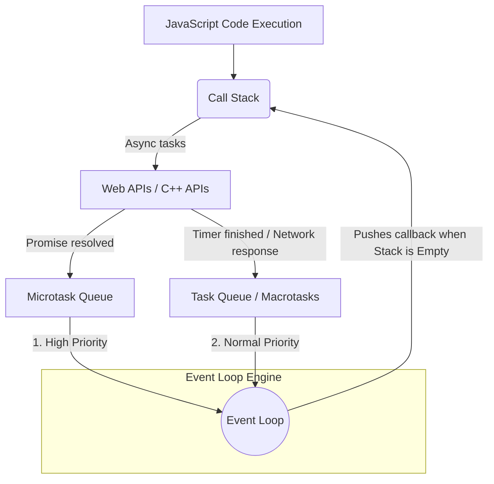

# The Event Loop in JavaScript

The **Event Loop** is the secret behind JavaScript's asynchronous behavior. Since JS is single-threaded, the Event Loop is responsible for executing the code, collecting and processing events, and executing queued sub-tasks.

## Architecture & Visualizing the Event Loop

Imagine these 4 core components working together:

1. **The Call Stack**: Where your JS code is pushed and executed frame by frame. (LIFO - Last In, First Out)
2. **Web APIs (or C++ APIs in Node.js)**: The browser/environment handles tasks like `setTimeout`, DOM events, HTTP requests (`fetch`), etc.
3. **The Task Queue (Callback / Macrotask Queue)**: Where callbacks from Web APIs wait to be executed. (FIFO - First In, First Out). Example: `setTimeout` callbacks.
4. **The Microtask Queue**: A higher priority queue used primarily for Promises (`.then`, `.catch`, `.finally`) and `MutationObserver`.

### Flow Diagram



## How It Works (Step-by-Step)

1. The JS Engine executes code from the **Call Stack**.
2. If it encounters an asynchronous operation (e.g., `setTimeout`, `fetch`), it hands it over to the **Web APIs** and pops it off the stack.
3. The Web API runs the task in the background. Once finished, it pushes the corresponding callback into either the **Microtask Queue** (for Promises) or the **Task Queue** (for timeouts/DOM events).
4. The **Event Loop** constantly checks two things:
   - *Is the Call Stack empty?*
   - *Are there any callbacks waiting in the queues?*
5. If the Call Stack is empty, the Event Loop first checks the **Microtask Queue**. It empties the *entire* Microtask queue into the Call Stack, one by one.
6. Once the Microtask queue is completely empty, the Event Loop takes the *first* callback from the **Task Queue** and pushes it to the Call Stack.

## Code Example

```javascript
console.log("1. Start");

setTimeout(() => {
    console.log("4. Timeout Callback (Macrotask)");
}, 0);

Promise.resolve().then(() => {
    console.log("3. Promise Callback (Microtask)");
});

console.log("2. End");
```

**Output:**
```
1. Start
2. End
3. Promise Callback (Microtask)
4. Timeout Callback (Macrotask)
```

**Why?**
1. Sync code runs first ("Start", "End").
2. The Promise callback goes to the Microtask queue.
3. The Timeout callback goes to the Task queue.
4. The Call Stack empties.
5. Event Loop checks Microtask Queue first -> Executes the Promise callback.
6. Event Loop checks Task Queue next -> Executes the Timeout callback.
