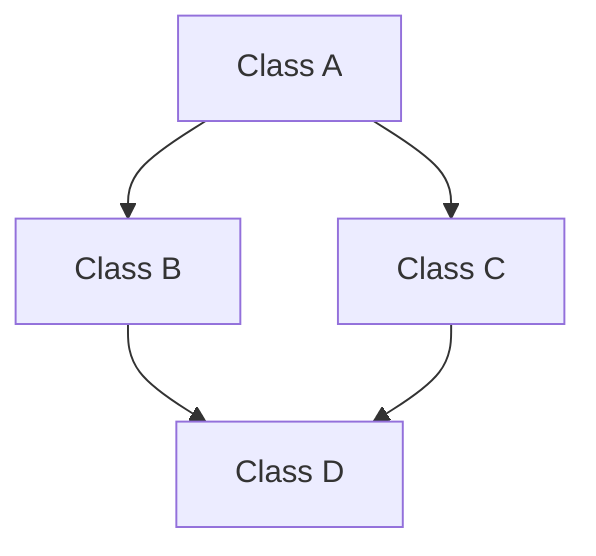

# The Diamond Problem in OOP

অবজেক্ট-ওরিয়েন্টিড প্রোগ্রামিংয়ে (OOP) মাল্টিপল ইনহেরিটেন্স (Multiple Inheritance) ব্যবহারের সময় যে জটিলতা বা দ্ব্যর্থতা (Ambiguity) তৈরি হয়, তাকে **Diamond Problem** বা ডায়মন্ড সমস্যা বলা হয়।

নিচে ডায়মন্ড প্রবলেম কী, কেন এটি ঘটে এবং Java ও C# এ এর সমাধান কীভাবে করা হয় তা বিস্তারিত আলোচনা করা হলো:

---

## ১. ডায়মন্ড প্রবলেম কী? (The Problem)

ধরা যাক, আমাদের চারটি ক্লাস আছে: `A`, `B`, `C`, এবং `D`।
* ক্লাস `B` এবং `C` উভয়ই ক্লাস `A` কে ইনহেরিট করে।
* ক্লাস `D` একই সাথে ক্লাস `B` এবং `C` উভয়কেই ইনহেরিট করে (মাল্টিপল ইনহেরিটেন্স)।

তাদের সম্পর্কটি দেখতে একটি ডায়মন্ড বা হিরকের মতো দেখায়:



### সমস্যাটি কোথায়?
ধরা যাক, ক্লাস `A` তে একটি মেথড আছে—`Show()`। ক্লাস `B` এবং `C` উভয়ই এই `Show()` মেথডটিকে ওভাররাইড (Override) করে নিজস্ব লজিক লিখেছে।

এখন, ক্লাস `D` যখন `Show()` মেথডটি কল করতে যাবে, তখন কম্পাইলার বিভ্রান্ত হয়ে যায়: **সে কি ক্লাস B এর Show() রান করবে, নাকি ক্লাস C এর Show() রান করবে?** 

এই সিদ্ধান্তের দ্ব্যর্থতা বা অস্পষ্টতাকেই ডায়মন্ড প্রবলেম বলা হয়।

---

## ২. Java এবং C# এ ডায়মন্ড প্রবলেমের সমাধান

ডায়মন্ড প্রবলেম এড়ানোর জন্য Java এবং C# এ ক্লাস লেভেলে **মাল্টিপল ইনহেরিটেন্স সরাসরি নিষিদ্ধ** করা হয়েছে।

```csharp
// Java বা C# এ এটি অবৈধ (Compile Error):
class D extends B, C { } // Java
class D : B, C { }       // C#
```

তবে, জাভা ও সি# এ **Interface** ব্যবহারের মাধ্যমে মাল্টিপল ইনহেরিটেন্সের সুবিধা দেওয়া হয়। ইন্টারফেসে মেথডের বডি বা ইমপ্লিমেন্টেশন থাকে না, তাই ডায়মন্ড প্রবলেম হওয়ার সুযোগ থাকে না। কিন্তু আধুনিক সংস্করণে ইন্টারফেসেও মেথডের বডি (Default Methods) লেখার সুবিধা আসায় কিছু নতুন নিয়ম তৈরি হয়েছে।

---

### ৩. Java-তে সমাধান (Java 8+)

Java 8 থেকে ইন্টারফেসে `default` মেথড লেখার সুবিধা যোগ করা হয়েছে। এর ফলে ইন্টারফেস দিয়েও ডায়মন্ড প্রবলেম হতে পারে:

```java
interface InterfaceB {
    default void show() {
        System.out.println("InterfaceB");
    }
}

interface InterfaceC {
    default void show() {
        System.out.println("InterfaceC");
    }
}

// ক্লাসটি দুটি ইন্টারফেস ইমপ্লিমেন্ট করছে
class MyClass implements InterfaceB, InterfaceC {
    // কম্পাইলার এখানে এরর দেবে এবং আপনাকে বাধ্য করবে মেথডটি ওভাররাইড করে দ্বন্দ্ব সমাধান করতে।
    @Override
    public void show() {
        // আমরা চাইলে যেকোনো একটি ইন্টারফেসের মেথডকে নির্দিষ্ট করে দিতে পারি:
        InterfaceB.super.show(); 
    }
}
```

---

### ৪. C#-এ সমাধান (C# 8.0+)

C# 8.0 থেকে ইন্টারফেসে **Default Interface Implementation** যুক্ত হয়েছে। C#-এ যদি দুটি ইন্টারফেসে একই নামের ডিফল্ট মেথড থাকে, তবে কম্পাইলার সরাসরি ক্লাস অবজেক্ট দিয়ে ওই মেথড কল করতে দেয় না। একে **Explicit Interface Implementation** এর মাধ্যমে সমাধান করতে হয়:

```csharp
interface IInterfaceB
{
    void Show() => Console.WriteLine("InterfaceB");
}

interface IInterfaceC
{
    void Show() => Console.WriteLine("InterfaceC");
}

class MyClass : IInterfaceB, IInterfaceC
{
    // ক্লাস নিজে কোনো মেথড ওভাররাইড না করলেও চলে
}

// কিন্তু ব্যবহারের সময় সরাসরি কল করা যাবে না:
MyClass obj = new MyClass();
// obj.Show(); // Compile Error!

// সমাধান: নির্দিষ্ট ইন্টারফেসে কাস্ট (Cast) করে কল করতে হবে:
((IInterfaceB)obj).Show(); // আউটপুট: InterfaceB
((IInterfaceC)obj).Show(); // আউটপুট: InterfaceC
```

---

## সারসংক্ষেপ (Summary)
* **ডায়মন্ড প্রবলেম:** মাল্টিপল ইনহেরিটেন্সে একই নামের মেথড দুই দিক থেকে আসার কারণে কম্পাইলারের সিদ্ধান্তহীনতা।
* **ক্লাস লেভেলে সমাধান:** Java এবং C# এ একাধিক ক্লাস ইনহেরিট করা নিষিদ্ধ।
* **ইন্টারফেস লেভেলে সমাধান:** ইন্টারফেস ব্যবহার করা হয়। ইন্টারফেসে ডিফল্ট মেথড থাকলে জাভাতে চাইল্ড ক্লাসে ওভাররাইড করে এবং সি#-এ এক্সপ্লিসিটলি কাস্ট করে ডায়মন্ড প্রবলেম সমাধান করতে হয়।
